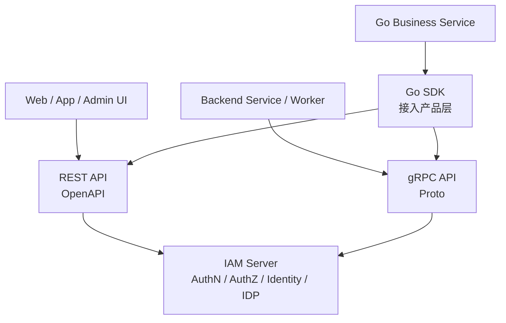
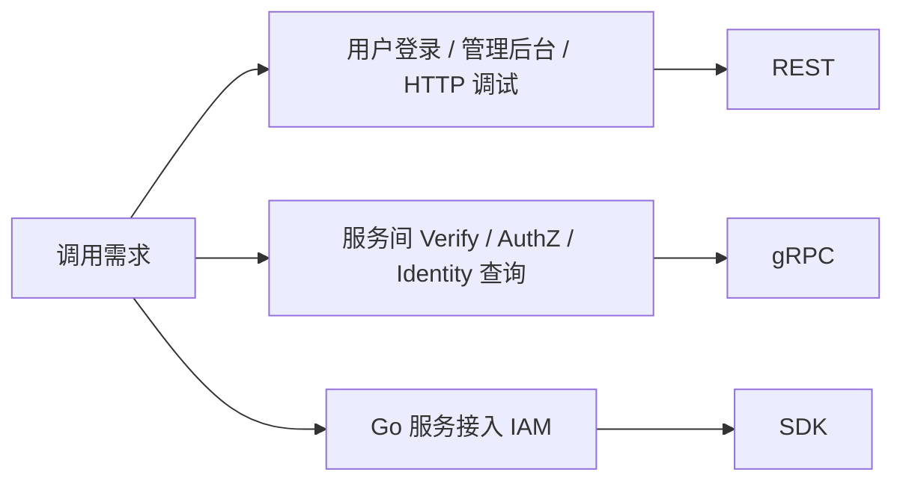
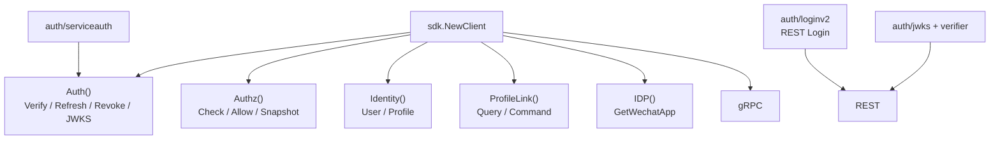

# REST / gRPC / SDK 接入讲法

## 本文用途

本文是 `08-宣讲` 模块中用于对外讲解 IAM 接入体系的材料。

它不是 REST/gRPC/SDK 契约说明书，而是帮你在面试、技术分享、项目介绍中讲清楚：

```text
IAM 为什么要同时提供 REST、gRPC 和 SDK？
三者分别服务什么调用方？
REST 为什么适合前端和管理后台？
gRPC 为什么适合服务间调用？
SDK 为什么是接入产品层？
业务系统应该怎么选接入方式？
这些契约如何防漂移？
```

这篇的核心目标是：  
**把 REST/gRPC/SDK 讲成一套面向不同调用方的接入体系，而不是接口数量堆叠。**

---

## 1. 一句话

```text
IAM 通过 REST、gRPC 和 Go SDK 提供分层接入：REST 面向 Web、App 和管理后台，gRPC 面向可信服务间调用，SDK 则把 REST/gRPC/JWKS/AuthZ Check 等能力封装成业务服务更容易使用的 Go 接入产品层。
```

更短版：

```text
REST 解决人和前端怎么接，gRPC 解决服务和服务怎么接，SDK 解决 Go 业务服务怎么少踩坑地接。
```

---

## 2. 30 秒讲法

```text
IAM 的接入体系分成 REST、gRPC 和 SDK 三层。REST 使用 OpenAPI 作为事实源，适合 Web、App、管理后台、登录和通用 HTTP 调试；gRPC 使用 proto 作为事实源，面向可信服务间调用，比如 VerifyToken、AuthZ Check、AuthorizationSnapshot、Identity 查询和 IDP 内部能力；SDK 是 Go 业务服务的接入产品层，它封装 gRPC client、REST LoginV2、JWKS、本地验证、ServiceAuth、AuthZ Check、错误处理和配置加载。三者不是重复建设，而是服务不同调用方和不同场景。
```

---

## 3. 1 分钟讲法

```text
IAM 作为基础服务，不能只提供一种接口。不同调用方的需求不同：前端、管理后台、移动端需要 HTTP 友好、容易调试、能用 OpenAPI 描述的 REST；后端服务之间需要强类型、低开销、适合内部认证和 ACL 的 gRPC；Go 业务服务则不应该自己手写 gRPC dial、JWKS 拉取、Token Verify、AuthZ Check 和 Service Token 刷新，所以提供 SDK 作为接入产品层。

REST 侧覆盖登录、Token、JWKS、AuthZ 管理、Identity 当前用户视角、IDP 管理和 Suggest。gRPC 侧覆盖 AuthN、AuthZ、Identity、ProfileLink、IDP 等服务间能力。SDK 侧通过 `sdk.NewClient` 统一初始化 gRPC 连接和子客户端，同时通过 `auth/loginv2` 封装 REST 登录，通过 `auth/jwks`、`auth/verifier`、`auth/serviceauth` 封装认证接入策略。

所以我不会把 REST/gRPC/SDK 讲成三套业务实现。它们只是同一套 IAM 能力面向不同调用方的接入投影。
```

---

## 4. 3 分钟讲法

```text
IAM 的接入体系我会从调用方出发讲，而不是从接口文件出发讲。

第一类调用方是 Web、App、管理后台和普通 HTTP 客户端。这类场景最适合 REST，因为 REST 易调试，能通过 OpenAPI 描述路径、字段、认证和错误响应，也适合登录、当前用户信息、管理后台操作。比如用户登录走 POST /api/v2/authn/login，当前用户档案走 /api/v2/identity/me 和 profile-links，授权管理和 IDP 管理也通过 REST 暴露。

第二类调用方是后端服务和 worker。它们更适合 gRPC，因为 gRPC 有强类型 proto，适合服务间调用，也适合配合 mTLS、service token、ACL 和 audit。当前 gRPC 提供 AuthService、AuthorizationService、IdentityRead、ProfileLinkQuery、ProfileLinkCommand、IDPService 等能力。业务服务可以通过 gRPC 做 VerifyToken、AuthZ Check、GetAuthorizationSnapshot、查询 ProfileLink 等。

第三类调用方是 Go 业务服务。理论上它们可以直接调 REST 或 gRPC，但如果每个服务都自己写连接、重试、metadata、JWKS、本地验签、service token 刷新和错误处理，会重复且容易出错。所以 IAM 提供 Go SDK。SDK 不是新的业务层，而是接入产品层：它通过 sdk.NewClient 建立 gRPC 连接并初始化 Auth、Authz、Identity、ProfileLink、IDP 子客户端；用户登录用 auth/loginv2 调 REST LoginV2；本地验签用 JWKSManager 和 TokenVerifier；服务间认证用 ServiceAuthHelper；授权判定用 Authz().Check、Allow、AllowScoped。

这三层的关系是：REST 和 gRPC 是机器契约，SDK 是消费这些契约的 Go 封装。真正的业务语义仍然在 IAM Server 的 AuthN、AuthZ、Identity、IDP 中。这样既能服务前端，也能服务后端，还能降低业务服务接入成本。
```

---

## 5. 白板图讲法

### 图一：三层接入模型



讲图时说：

```text
REST、gRPC、SDK 不是三套业务逻辑，而是同一套 IAM server 能力面向不同调用方的接入方式。
```

---

### 图二：REST / gRPC / SDK 选择



讲图时说：

```text
选择接入方式不是看哪种技术更高级，而是看调用方是谁、要解决什么问题。
```

---

### 图三：SDK 封装关系



讲图时说：

```text
SDK 不是业务层，而是把 REST/gRPC/JWKS/ServiceAuth 这些接入能力封装成 Go 服务更容易使用的 API。
```

---

## 6. REST 要讲清楚什么

### 6.1 REST 的定位

```text
REST 面向 Web、App、管理后台、登录和通用 HTTP 接入。
```

### 6.2 REST 的事实源

```text
api/rest/*.yaml
```

REST 使用 OpenAPI 3.1。  
OpenAPI 是字段、路径、认证和错误响应的事实源。

### 6.3 REST 覆盖的能力

```text
AuthN：登录、登录准备、Refresh、Logout、Verify、JWKS
AuthZ：Check、Roles、Assignments、Policies、Resources
Identity：me、profiles、profile-links
IDP：health、wechat-apps
Suggest：profile suggest
Debug：routes、modules、cache-governance
```

### 6.4 REST 适合讲的价值

```text
前端友好
调试方便
OpenAPI 可文档化
适合登录和管理面
适合当前用户视角
```

### 6.5 REST 不适合讲成什么

不要说：

```text
REST 是全部能力的唯一入口。
```

因为服务间能力更适合 gRPC，Go 服务更适合 SDK。

---

## 7. gRPC 要讲清楚什么

### 7.1 gRPC 的定位

```text
gRPC 面向可信服务间调用。
```

### 7.2 gRPC 的事实源

```text
api/grpc/iam/*/v2/*.proto
```

### 7.3 gRPC 服务矩阵

当前 proto 包括：

```text
authn/v2
authz/v2
identity/v2
idp/v2
```

服务包括：

```text
AuthService
AccountOnboardingService
JWKSService
AuthorizationService
IdentityRead
ProfileLinkQuery
ProfileLinkCommand
IdentityLifecycle
IDPService
```

### 7.4 gRPC 适合的场景

```text
后端服务在线 VerifyToken
服务间 AuthZ Check
拉取 AuthorizationSnapshot
系统侧 Identity 查询
ProfileLink Query / Command
IDP 内部高信任读取
Service Token
mTLS / ACL / audit
```

### 7.5 gRPC 不适合讲成什么

不要说：

```text
gRPC 是前端直接调用入口。
```

它的定位是可信服务间调用，不是普通公网客户端入口。

---

## 8. SDK 要讲清楚什么

### 8.1 SDK 的定位

```text
SDK 是 Go 服务端接入 IAM 的产品化封装。
```

它不是：

```text
新的业务层
新的授权规则
新的认证事实源
```

### 8.2 SDK 的事实源

```text
pkg/sdk
pkg/sdk/README.md
pkg/sdk/public_api_compile_test.go
```

### 8.3 SDK 公开稳定面

当前 SDK README 固定公开包：

```text
pkg/sdk
pkg/sdk/config
pkg/sdk/auth/client
pkg/sdk/auth/jwks
pkg/sdk/auth/verifier
pkg/sdk/auth/serviceauth
pkg/sdk/authz
pkg/sdk/identity
pkg/sdk/idp
pkg/sdk/errors
```

`transport`、`observability` 和高级错误分析能力已经收回 internal。

### 8.4 sdk.Client 做什么

`sdk.Client` 创建：

```text
grpc.ClientConn
Auth client
Authz client
Identity client
ProfileLink client
IDP client
```

并提供：

```text
Auth()
Authz()
Identity()
ProfileLink()
IDP()
Close()
```

### 8.5 SDK 适合讲的价值

```text
减少业务服务重复接入代码
统一配置和 TLS
统一 metadata
统一错误判断
封装 JWKS / Verify / ServiceAuth
封装 AuthZ Check
封装 Identity/ProfileLink 查询
```

---

## 9. 三者的选择规则

| 场景 | 推荐接入 | 原因 |
|---|---|---|
| 用户登录 | REST / SDK loginv2 | 登录事实源是 REST AuthN v2 |
| Web/App 当前用户接口 | REST | HTTP 友好，JWT middleware，current-user 语义 |
| 管理后台 | REST | OpenAPI、调试、管理面友好 |
| 服务间 Token Verify | gRPC / SDK | 强类型、内部调用、可配 service token |
| AuthZ Check | gRPC / SDK | 高频服务间判定 |
| AuthorizationSnapshot | gRPC / SDK | 服务间缓存和版本治理 |
| Identity 系统侧查询 | gRPC / SDK | 后端服务查 User/Profile/ProfileLink |
| IDP 内部读取 | gRPC / SDK | 高信任内部能力 |
| Go 业务服务接入 | SDK | 少写重复 client 代码 |
| API Gateway 本地验签 | JWKS | 标准公钥分发 |
| 脚本/curl 调试 | REST | 直接可调 |

---

## 10. 设计亮点

### 10.1 按调用方设计接入方式

```text
前端/管理后台用 REST
后端服务用 gRPC
Go 服务用 SDK
```

价值：

```text
不是为了炫技术，而是不同调用场景需要不同契约形态。
```

---

### 10.2 机器契约和 SDK 封装分离

```text
OpenAPI / proto 是机器契约
SDK 是 Go 封装
```

价值：

```text
SDK 变化不能替代契约事实源，契约变化也必须同步 SDK。
```

---

### 10.3 SDK 不复制业务规则

```text
SDK 只调用 IAM，不本地实现 AuthZ / ProfileLink / IDP 规则。
```

价值：

```text
避免业务规则出现第二事实源。
```

---

### 10.4 接入安全边界明确

```text
REST 有 JWT middleware
gRPC 支持 mTLS/service token/ACL/audit
IDP gRPC 是高信任接口
SDK 只是封装，不降低风险等级
```

---

### 10.5 有防漂移机制

```text
REST 有 route/schema contract
gRPC 有 proto contract test
SDK 有 public API compile test
docs 有 docs-hygiene
```

价值：

```text
接入契约不靠口头约定维护。
```

---

## 11. 不推荐的讲法

### 11.1 “我们有 REST、gRPC、SDK 三套接口”

问题：

```text
容易让人以为是三套业务逻辑。
```

推荐改成：

```text
REST、gRPC、SDK 是同一套 IAM 能力面向不同调用方的接入投影。
```

---

### 11.2 “SDK 是业务层”

问题：

```text
错误。SDK 是接入产品层，不定义业务规则。
```

推荐改成：

```text
SDK 封装 REST/gRPC/JWKS/ServiceAuth 等接入复杂度，业务规则仍在 IAM Server。
```

---

### 11.3 “gRPC 比 REST 高级，所以都用 gRPC”

问题：

```text
技术偏见。登录、管理后台和前端仍然适合 REST。
```

推荐改成：

```text
按调用方和场景选协议。
```

---

### 11.4 “REST 只是调试用”

问题：

```text
不准确。REST 是 Web/App/Admin 的正式契约。
```

---

### 11.5 “SDK 可以让业务方不用理解安全边界”

问题：

```text
不对。SDK 降低接入成本，但不能替代调用方理解 local verify、online verify、IDP secret、ProfileLink 与 AuthZ 的边界。
```

---

## 12. 面试常见问题回答

### Q1：为什么同时提供 REST、gRPC、SDK？

```text
因为调用方不同。REST 适合 Web、App、管理后台和登录；gRPC 适合后端服务间调用，比如 VerifyToken、AuthZ Check、Identity 查询；SDK 适合 Go 业务服务接入 IAM，封装连接、TLS、metadata、JWKS、Verify、ServiceAuth、AuthZ Check 和错误处理。它们不是重复业务逻辑，而是同一套 IAM 能力的不同接入投影。
```

---

### Q2：REST 和 gRPC 怎么划分？

```text
REST 更偏用户侧和管理侧，事实源是 OpenAPI，适合登录、当前用户、管理后台和 HTTP 调试。gRPC 更偏服务间调用，事实源是 proto，适合 AuthN Verify、AuthZ Check、AuthorizationSnapshot、Identity/ProfileLink 系统侧查询和 IDP 高信任读取。
```

---

### Q3：SDK 为什么不是业务层？

```text
SDK 不定义 User、Session、Permission、ProfileLink 等业务规则，也不本地实现授权判定。它只是把 REST/gRPC/JWKS/ServiceAuth 这些接入能力封装成稳定 Go API。业务规则仍然在 IAM Server 的 domain/application 中。
```

---

### Q4：用户登录为什么不在 `sdk.Client.Auth()`？

```text
因为当前用户登录的事实契约是 REST AuthN v2 的 `/api/v2/authn/login`，而 `client.Auth()` 是 gRPC AuthN token/JWKS/onboarding client。SDK 按真实契约封装，所以用户登录放在 `auth/loginv2`。
```

---

### Q5：业务服务应该直接调 gRPC 还是用 SDK？

```text
如果是 Go 服务，优先用 SDK，因为 SDK 已经封装连接、配置、metadata、错误、JWKS、ServiceAuth 和常见 client。只有需要非常底层控制或非 Go 语言时，才直接使用 gRPC proto。
```

---

### Q6：SDK 会不会隐藏太多安全细节？

```text
SDK 会降低接入成本，但不能隐藏安全语义。比如 JWKS 本地验签不等于在线 Verify，ProfileLink 不等于 AuthZ 权限，IDP.GetWechatApp 是高信任内部能力。这些边界必须在 SDK 文档和接入文档中明确。
```

---

### Q7：如何防止 REST/gRPC/SDK 漂移？

```text
REST 通过 OpenAPI、router matrix 和 route/schema contract 检查；gRPC 通过 proto contract test 确认 proto service 有 runtime registration；SDK 通过 public API compile test 固定公开稳定面；文档通过 docs-hygiene 防止断链和旧事实回流。
```

---

## 13. 与其他模块的关系

### 13.1 与 AuthN

```text
REST 提供 Login，gRPC 提供 Verify/Refresh/Revoke/JWKS，SDK 封装 LoginV2、Verify、JWKS、ServiceAuth。
```

### 13.2 与 AuthZ

```text
REST 提供 AuthZ 管理和 check，gRPC 提供 AuthorizationService，SDK 提供 Check/Allow/AllowScoped/Snapshot。
```

### 13.3 与 Identity

```text
REST 提供当前用户视角，gRPC 提供系统侧 Identity/ProfileLink，SDK 封装系统侧查询和命令。
```

### 13.4 与 IDP

```text
REST 提供 IDP 管理面，gRPC/SDK 提供高信任内部读取。
```

---

## 14. 证据链索引

| 讲法 | 证据 |
|---|---|
| REST 使用 OpenAPI 3.1，OpenAPI 是字段、路径、认证和错误响应事实源 | `api/rest/README.md` |
| REST 覆盖 AuthN/AuthZ/Identity/IDP/Suggest/Debug 路由 | `api/rest/README.md` |
| gRPC 面向可信服务间调用 | `api/grpc/README.md` |
| gRPC 当前只发布 v2 proto，包含 authn/authz/identity/idp | `api/grpc/README.md` |
| gRPC 服务矩阵包含 AuthService、AuthorizationService、IdentityRead、ProfileLinkQuery/Command、IDPService | `api/grpc/README.md` |
| SDK 是 IAM 官方 Go 接入入口 | `pkg/sdk/README.md` |
| SDK 公开稳定包固定，internal transport/observability 不公开 | `pkg/sdk/README.md` |
| `sdk.Client` 初始化 Auth/Authz/Identity/ProfileLink/IDP 子客户端 | `pkg/sdk/client.go` |
| SDK 快速开始使用 `sdk.NewClient` 和 `client.Auth().VerifyToken` | `pkg/sdk/README.md` |
| SDK 封装 JWKS、Verifier、ServiceAuth、AuthZ、Identity、IDP | `pkg/sdk/README.md` |

---

## 15. 简历项目描述版本

```text
设计并完善 IAM 的 REST/gRPC/SDK 接入体系：REST 使用 OpenAPI 作为事实源，面向 Web、App 和管理后台，覆盖登录、Token、AuthZ、Identity、IDP 等接口；gRPC 使用 proto 作为事实源，面向可信服务间调用，提供 VerifyToken、AuthZ Check、AuthorizationSnapshot、Identity/ProfileLink 查询和 IDP 内部能力；Go SDK 作为接入产品层，封装 gRPC client、REST LoginV2、JWKS、本地验证、ServiceAuth、AuthZ Check、错误处理和配置加载，降低业务服务接入 IAM 的复杂度，并通过契约测试和 public API compile test 防止接口漂移。
```

---

## 16. 30 分钟分享中的位置

如果做 30 分钟技术分享，REST/gRPC/SDK 接入建议占：

```text
4-5 分钟
```

结构：

```text
1 分钟：为什么需要三种接入方式
1 分钟：REST 适合什么
1 分钟：gRPC 适合什么
1 分钟：SDK 封装什么
1 分钟：契约防漂移和追问
```

---

## 17. 本文总结

REST / gRPC / SDK 接入讲法的核心是：

```text
不要把它讲成“三套接口”。
```

应该讲成：

```text
三类调用方
三种接入方式
同一套 IAM 能力
```

推荐最终表达：

```text
IAM 对外提供 REST、gRPC 和 Go SDK 三层接入。REST 以 OpenAPI 为事实源，面向 Web、App、管理后台和登录场景；gRPC 以 proto 为事实源，面向可信服务间调用，提供 VerifyToken、AuthZ Check、Identity/ProfileLink 查询等能力；SDK 是 Go 服务端接入产品层，封装 REST/gRPC/JWKS/ServiceAuth/AuthZ Check 等复杂度，但不定义业务规则。三者服务不同调用方，底层仍然回到同一套 IAM Server 的 AuthN、AuthZ、Identity、IDP 能力。
```
