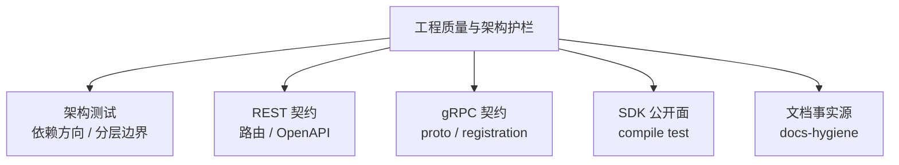
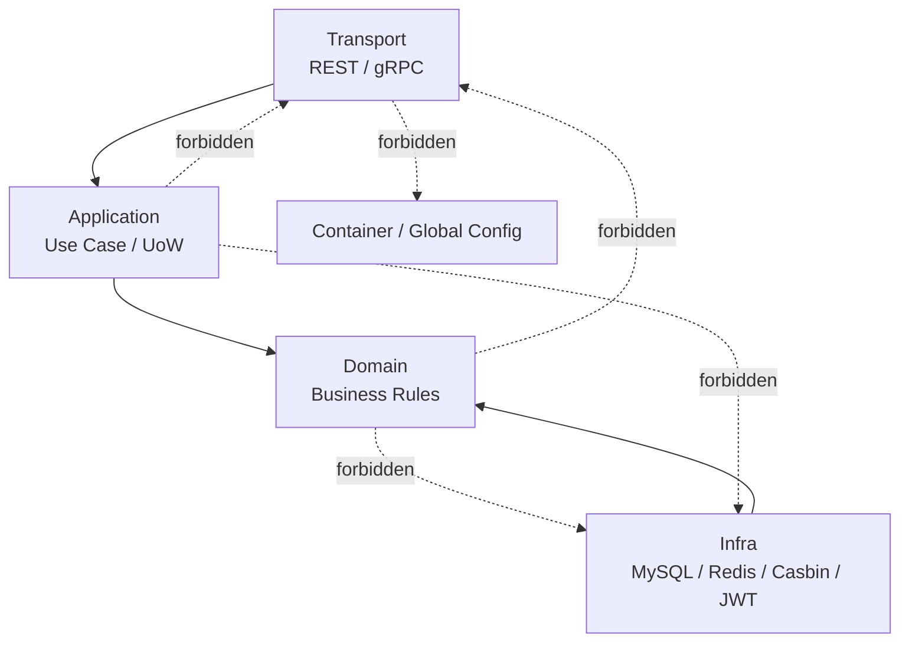
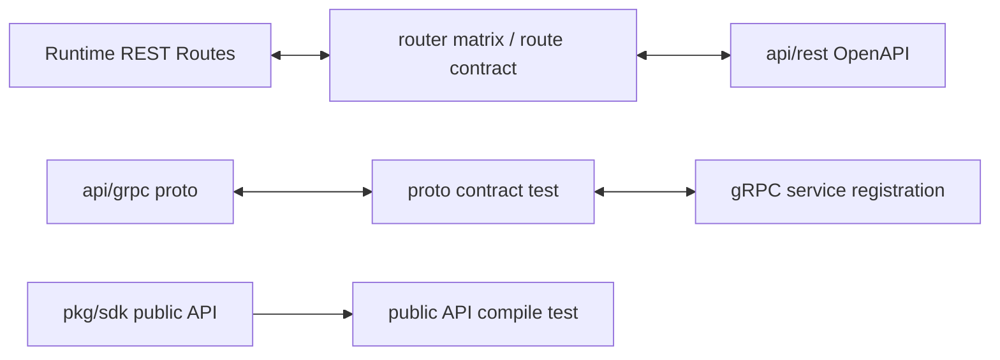

# 工程质量与架构护栏讲法

## 本文用途

本文是 `08-宣讲` 模块中用于对外讲解 IAM 工程质量与架构护栏的材料。

它不是测试清单，也不是 CI 命令合集，而是帮你在面试、技术分享、项目介绍中讲清楚：

```text
IAM 如何防止系统长期演进成大泥球？
架构测试保护什么？
REST/gRPC/SDK 契约如何防漂移？
文档事实源如何防止旧事实回流？
为什么这些护栏是工程质量的一部分，而不是“洁癖”？
怎么把这些内容讲成项目亮点？
```

这篇的核心目标是：  
**把工程质量讲成“边界可验证、契约可追踪、文档可信、演进可控”，而不是泛泛说“我写了很多测试”。**

---

## 1. 一句话

```text
IAM 的工程质量不只靠单元测试，而是通过架构测试、REST/gRPC 契约测试、SDK public API compile test 和 docs-hygiene，把分层边界、接入契约、公开 API 和文档事实源都变成可自动验证的护栏。
```

更短版：

```text
IAM 用自动化护栏防止架构边界、接口契约、SDK 公开面和文档事实源在长期演进中漂移。
```

---

## 2. 30 秒讲法

```text
IAM 不是只做功能测试，还专门做了架构护栏。比如 architecture tests 会检查 domain 不能依赖 infra/database，application 不能依赖 transport/infra，REST router 不能依赖 container 或 viper，assembler 不能构造 transport，AuthZ domain 不能出现 Casbin p/g/r 这类基础设施事实。接口层也有护栏：REST router matrix 会检查关键路由和 OpenAPI 覆盖，gRPC proto contract test 会检查 proto 里声明的 service 是否有 runtime registration，SDK public API compile test 会固定对外稳定符号，docs-hygiene 会检查活跃文档断链和旧事实引用。这样系统长期演进时，不容易退回大泥球。
```

---

## 3. 1 分钟讲法

```text
这个项目的工程质量，我主要从四类护栏讲。

第一类是架构测试，保护代码依赖方向。IAM 采用分层和六边形架构，所以 domain 不能依赖 infra，application 不能依赖 transport，REST router 不能直接拿 container，container/assembler 也不能退回 interface{} 式依赖。AuthZ 还有专项护栏，防止 Casbin p/g/r facts 进入 domain，保证领域语言仍然是 Role、Resource、Permission、RoleBinding。

第二类是接口契约测试。REST 侧通过 router matrix 和 OpenAPI contract 检查关键路由是否注册、已注册 public routes 是否被 OpenAPI 覆盖。gRPC 侧通过 proto contract test 扫描 proto service，并确认 transport/grpc/service 里存在对应 Register 调用。

第三类是 SDK 公开面测试。SDK 是外部 Go 服务会 import 的包，所以用 public API compile test 固定 `sdk.NewClient`、auth/loginv2、jwks、verifier、serviceauth、authz、identity、idp、errors 等公开符号，避免无意 breaking change。

第四类是文档卫生。docs-hygiene 检查活跃文档链接和退役路径、旧路由、旧术语，防止旧文档事实回流。这样文档也能保持可信。
```

---

## 4. 3 分钟讲法

```text
IAM 的工程质量，我不会只说“写了单元测试”，因为这个系统的复杂度主要在边界和契约上。系统有 AuthN、AuthZ、Identity、IDP、REST、gRPC、SDK、Outbox 等多个边界，如果只靠开发约定，长期演进一定会漂移。所以我把关键边界做成了自动化护栏。

第一层是架构依赖护栏。比如 domain 层只表达业务规则，不能 import infra/database；application 层负责编排用例，不能 import transport/infra；REST router 只能消费 explicit deps，不能直接依赖 container 或全局 viper；assembler 只能暴露 application/domain capability，不能构造 REST/gRPC transport。这些都由 internal/pkg/architecture/architecture_test.go 扫描 imports 和源码 token 来保护。

第二层是 AuthZ 专项护栏。AuthZ 很容易被 Casbin 技术细节污染，所以架构测试明确禁止 CasbinAdapter、PolicyRule、GroupingRule、Sub/Dom/Obj/Act 这些 p/g/r 技术事实进入 domain。domain 里应该保留 Role、Resource、Permission、RoleBinding、Scope 这些业务语言。这样 Casbin 只是 infra runtime engine，而不是业务模型。

第三层是接入契约护栏。REST 侧有 router matrix test，既检查关键路由是否注册，也检查已注册 public routes 是否被 OpenAPI 覆盖。gRPC 侧有 proto contract test，会扫描 api/grpc/iam 下所有 proto service，并确认 transport/grpc/service 中存在对应 Register<Service>Server 调用。SDK 侧有 public API compile test，固定公开稳定 API，防止外部调用方升级后编译失败。

第四层是文档事实源护栏。IAM 的 docs 不是随便写文章，而是有 docs-hygiene。它会检查活跃文档的相对链接是否存在，也会检查是否引用退役包、旧路由、旧术语，比如旧的 interface 包、旧 auth route、旧 identity refs、旧 assignment 包等。归档文档放在 _archive，不作为当前事实源。

这套工程质量体系的价值是：当系统继续迭代时，不是靠口头约定说“别乱依赖”“别乱改接口”“别引用旧文档”，而是让测试和脚本在 CI 中直接失败。这样 IAM 才能作为基础服务长期维护。
```

---

## 5. 白板图讲法

### 图一：工程质量四类护栏



讲图时说：

```text
我把工程质量分成五个可验证层面：代码架构、REST 契约、gRPC 契约、SDK 公开面和文档事实源。
```

---

### 图二：分层依赖护栏



讲图时说：

```text
架构测试保护的不是目录风格，而是依赖方向。核心规则是业务规则向内，协议和基础设施向外。
```

---

### 图三：契约防漂移



讲图时说：

```text
REST、gRPC、SDK 各自都有事实源和测试，不靠人工记忆维护接口一致性。
```

---

## 6. 工程质量要讲清楚的五个核心概念

### 6.1 架构测试

讲法：

```text
架构测试不是业务测试，而是验证代码结构有没有破坏约定的依赖边界。
```

保护：

```text
domain 不依赖 infra
application 不依赖 transport/infra
REST router 不依赖 container/viper
assembler 不用 interface{} 装配
AuthZ domain 不出现 Casbin facts
```

---

### 6.2 契约测试

讲法：

```text
契约测试保护运行时注册和机器契约不漂移。
```

保护：

```text
REST routes 与 OpenAPI
gRPC proto 与 service registration
```

---

### 6.3 Public API compile test

讲法：

```text
SDK 是外部调用方会 import 的包，所以公开符号需要编译期护栏。
```

保护：

```text
sdk.NewClient
Config
auth/loginv2
jwks
verifier
serviceauth
authz
identity
idp
errors
```

---

### 6.4 docs-hygiene

讲法：

```text
文档也会漂移，所以 active docs 需要检查断链和退役事实引用。
```

保护：

```text
链接存在
不引用旧 route
不引用旧 package
不引用旧术语
_archive 不作为当前事实源
```

---

### 6.5 架构护栏不是洁癖

讲法：

```text
这些护栏不是为了让代码好看，而是为了让 IAM 作为基础服务在长期迭代中还能保持边界清楚、契约可信、文档可用。
```

---

## 7. 设计亮点

### 7.1 用测试保护架构，而不是只靠约定

```text
domain/application/transport/container 的边界由 architecture tests 扫描。
```

价值：

```text
新代码一旦破坏依赖方向，CI 能直接失败。
```

---

### 7.2 AuthZ 有专项边界保护

```text
Casbin facts 不进入 domain，assignment 包不回流。
```

价值：

```text
保证 AuthZ 业务语言稳定，不被 infra 技术细节污染。
```

---

### 7.3 REST/gRPC 契约有机器校验

```text
REST 路由与 OpenAPI 对齐，proto service 与 runtime registration 对齐。
```

价值：

```text
接口文档和运行时代码不容易各说各话。
```

---

### 7.4 SDK 公共面有兼容性护栏

```text
public API compile test 固定 SDK 对外稳定符号。
```

价值：

```text
外部业务服务升级 SDK 时不容易被无意 breaking change 打断。
```

---

### 7.5 文档也被当成工程资产

```text
docs-hygiene 检查 active docs 的链接和退役事实引用。
```

价值：

```text
文档不只是“写完就算”，而是纳入工程质量体系。
```

---

## 8. 不推荐的讲法

### 8.1 “我写了很多测试”

问题：

```text
太泛。没有说明测试保护什么。
```

推荐改成：

```text
除了业务测试，我还用架构测试和契约测试保护分层边界、接口契约和 SDK 公共面。
```

---

### 8.2 “我用了六边形架构”

问题：

```text
如果没有护栏，容易变成口号。
```

推荐改成：

```text
我用 architecture tests 检查 domain/application/transport/container 的依赖边界，防止六边形架构退化。
```

---

### 8.3 “文档我都写了”

问题：

```text
文档也可能过期。
```

推荐改成：

```text
我通过 docs-hygiene 检查 active docs 的链接和退役事实引用，避免旧事实回流。
```

---

### 8.4 “接口按文档来”

问题：

```text
文档不是机器契约。
```

推荐改成：

```text
REST 以 OpenAPI 为事实源，gRPC 以 proto 为事实源，SDK 以 public API compile test 固定公开面。
```

---

### 8.5 “Casbin 就是授权模型”

问题：

```text
错误。Casbin 是 infra runtime engine。
```

推荐改成：

```text
授权模型是 Role、Resource、Permission、RoleBinding、Scope，Casbin facts 只在 infra 层。
```

---

## 9. 面试常见问题回答

### Q1：你怎么保证项目不会越写越乱？

```text
我没有只靠口头约定，而是加了架构测试。比如 domain 不能依赖 infra/database，application 不能依赖 transport/infra，REST router 不能依赖 container 或全局 viper，assembler 必须使用 typed deps，不能退回 interface{} 装配。这样新代码一旦破坏边界，测试会直接失败。
```

---

### Q2：什么是架构测试？和单元测试有什么区别？

```text
单元测试验证业务行为，比如登录是否成功、权限判定是否正确。架构测试验证代码结构，比如某层是否依赖了不该依赖的包，某些退役包是否回流，某些技术事实是否进入 domain。它保护的是长期可维护性。
```

---

### Q3：你怎么防止 REST 文档和代码不一致？

```text
REST 使用 OpenAPI 作为字段、路径和错误响应事实源。运行时有 router matrix test，会检查关键路由是否注册，也会检查已注册 public routes 是否被 OpenAPI 覆盖。此外 route/schema contract scripts 会比较 swagger 和 api/rest specs。
```

---

### Q4：你怎么防止 gRPC proto 和服务注册不一致？

```text
gRPC 有 proto contract test，会扫描 api/grpc/iam 下所有 proto 文件里的 service 声明，然后检查 transport/grpc/service 源码中是否存在对应 Register<Service>Server 调用。如果 proto 声明了服务但运行时没有注册，测试会失败。
```

---

### Q5：SDK 的兼容性怎么保证？

```text
SDK 有 public API compile test，固定对外稳定符号，比如 sdk.NewClient、Config、auth/loginv2、jwks、verifier、serviceauth、authz、identity、idp、errors 等。如果这些公开 API 被误删或签名不兼容，编译测试会失败。
```

---

### Q6：文档怎么防止过期？

```text
首先文档明确自己是解释层，REST/gRPC/SDK/源码各有事实源。其次 docs-hygiene 会检查 active docs 的相对链接是否存在，并检查是否引用退役路径、旧路由和旧术语。归档文档放在 _archive，不作为当前事实源。
```

---

### Q7：为什么要禁止 Casbin facts 进入 domain？

```text
因为 Casbin 是运行时策略引擎，不是业务模型。业务模型应该是 Role、Resource、Permission、RoleBinding、Scope。如果 domain 里出现 p/g/r、Sub/Dom/Obj/Act 这类 Casbin 技术语言，就会让业务层被基础设施污染，后续扩展和替换都困难。
```

---

### Q8：这些护栏会不会降低开发效率？

```text
短期会增加一些约束，但长期能降低重构成本。IAM 是基础服务，认证、授权、身份和接入契约一旦混乱，后续修复成本很高。架构护栏相当于提前把边界固化，避免项目慢慢变成大泥球。
```

---

## 10. 与其他模块的关系

### 10.1 与系统架构

```text
架构讲法说明分层，架构护栏保证分层不退化。
```

### 10.2 与 AuthZ

```text
AuthZ 是最容易被 infra 事实污染的模块，所以有 Casbin facts 和 assignment 回流专项检查。
```

### 10.3 与 REST/gRPC/SDK

```text
接入层的质量不只看 handler 和 service 能跑，还要看契约与运行时是否一致。
```

### 10.4 与文档体系

```text
文档是工程资产，需要 facts source 和 hygiene，而不是随手写。
```

---

## 11. 证据链索引

| 讲法 | 证据 |
|---|---|
| domain 不能依赖 infra/database | `TestDomainPackagesDoNotAddInfrastructureDependencies` |
| application 不能依赖 transport/infra | `TestApplicationPackagesDoNotAddTransportOrInfrastructureDependencies` |
| REST router 不能依赖 container/viper | `TestRESTRouterDoesNotImportCompositionOrGlobalConfig` |
| application/container 不能直接读 viper | `TestRuntimeCompositionDoesNotReadGlobalConfigDirectly` |
| assembler 必须 typed deps | `TestAssemblerModulesUseTypedDependencies` |
| assembler 不构造 transport | `TestAssemblerDoesNotConstructTransportImplementations` |
| legacy interface 包不能回流 | `TestLegacyInterfacePackageIsRetired` |
| container capability navigation 只能在 collectors | `TestContainerCapabilityNavigationStaysInCollectors` |
| AuthZ Casbin facts 不进入 domain/application/transport | `TestAuthzCasbinFactsStayBehindApplicationPorts` |
| REST 关键路由和 OpenAPI 覆盖 | `router_matrix_test.go` |
| gRPC proto service 必须有 Register 调用 | `proto_contract_test.go` |
| SDK public API 固定 | `public_api_compile_test.go` |
| docs-hygiene 检查 active docs 链接和 retired references | `scripts/check-docs-links.py` |

---

## 12. 简历项目描述版本

```text
为 IAM 项目建立工程质量与架构护栏体系：通过 architecture tests 约束 domain/application/transport/container 依赖方向，防止 domain 依赖 infra、application 依赖 transport、REST router 依赖 container，以及 AuthZ domain 被 Casbin p/g facts 污染；通过 REST router matrix 和 OpenAPI contract 检查接口文档与运行时路由一致性；通过 gRPC proto contract test 保证 proto service 与 runtime registration 对齐；通过 SDK public API compile test 固定 Go SDK 对外稳定面；通过 docs-hygiene 检查活跃文档断链和旧事实引用，降低长期演进中的架构漂移与文档漂移风险。
```

---

## 13. 30 分钟分享中的位置

如果做 30 分钟技术分享，工程质量与架构护栏建议占：

```text
3-4 分钟
```

结构：

```text
1 分钟：为什么基础服务需要架构护栏
1 分钟：architecture tests 保护依赖边界
1 分钟：REST/gRPC/SDK 契约防漂移
1 分钟：docs-hygiene 与文档事实源
```

---

## 14. 本文总结

工程质量与架构护栏讲法的核心是：

```text
不要只说“我写了测试”。
```

应该讲成：

```text
我把系统长期演进中最容易漂移的边界变成了自动化验证。
```

推荐最终表达：

```text
IAM 的工程质量不只靠单元测试，而是通过架构测试、契约测试、SDK compile test 和 docs-hygiene 建立多层护栏。架构测试保护 domain/application/transport/container 的依赖方向，防止 AuthZ 被 Casbin 技术事实污染；REST 和 gRPC 契约测试保护 OpenAPI/proto 与运行时注册一致；SDK public API compile test 保护外部 Go 调用方的稳定接入面；docs-hygiene 保护文档链接和事实源，防止旧路由、旧包、旧术语回流。这样 IAM 作为基础服务在长期演进中更不容易退化成大泥球。
```
