# 架构图素材索引

## 本文用途

本文是 `08-宣讲` 模块的架构图素材库。

它不是一篇连续阅读的技术文章，而是为以下场景准备的图表索引：

```text
技术分享 PPT
面试白板讲解
简历项目答辩
README / docs 插图
Notion 项目复盘
30 分钟技术分享脚本配图
```

本文回答：

```text
IAM 项目可以画哪些图？
每张图适合讲什么？
每张图应该放在哪篇宣讲文档里？
面试时怎么用一张图讲清楚一个设计点？
```

使用建议：

```text
1. 不要一次性展示所有图；
2. 面试时最多准备 3-5 张核心图；
3. 技术分享时按“总览 -> 模块 -> 关键链路 -> 工程护栏”顺序展示；
4. 每张图都要服务一个问题，不要为了复杂而复杂。
```

---

## 1. 图谱总览

推荐把 IAM 架构图分成八类：

```text
A. 项目定位图
B. 系统架构图
C. 运行时装配图
D. AuthN 认证链路图
E. AuthZ 授权链路图
F. Identity / ProfileLink 图
G. IDP 与第三方登录图
H. 接入与工程护栏图
```

| 类别 | 图名 | 用途 | 优先级 |
| --- | --- | --- | --- |
| A | IAM 总定位图 | 讲 IAM 不是普通用户中心 | P0 |
| B | 分层架构主图 | 讲 Transport/Application/Domain/Infra | P0 |
| B | 模块边界图 | 讲 AuthN/AuthZ/Identity/IDP | P0 |
| C | 运行时装配图 | 讲 process/container/REST/gRPC/runtime task | P1 |
| D | AuthN 登录主链路图 | 讲 Login -> Principal -> Session -> Token | P0 |
| D | JWKS vs 在线 Verify 图 | 讲 token 签名可信 vs 当前可用 | P0 |
| D | KeyRotation 状态机 | 讲 active/grace/retired | P1 |
| E | AuthZ 授权模型图 | 讲 Subject/RoleBinding/Role/Permission/Resource | P0 |
| E | AuthZ Check 链路图 | 讲 AuthorizationRequest -> DecisionEngine -> Casbin | P0 |
| E | AuthZ 写入链路图 | 讲 PolicyChange/UoW/Version/Outbox/Reload | P0 |
| F | User/Profile/ProfileLink 图 | 讲身份主体与业务档案关系 | P0 |
| F | 当前用户 Profile 访问 guard 图 | 讲 MyProfiles 防越权 | P1 |
| G | IDP 与 AuthN 边界图 | 讲 IDP 只做身份源基础设施 | P0 |
| G | 微信登录链路图 | 讲 code2Session 不等于 IAM 登录成功 | P1 |
| H | REST/gRPC/SDK 接入图 | 讲三类调用方和三种接入方式 | P0 |
| H | 工程护栏图 | 讲 architecture/contract/SDK/docs 防漂移 | P1 |

---

# A. 项目定位图

## A1. IAM 总定位图

### 适用文档

```text
00-项目一句话定位.md
01-业务背景与问题.md
11-30分钟技术分享脚本.md
```

### 适合回答

```text
这个项目到底是什么？
为什么不是普通用户中心？
IAM 包含哪些核心能力？
```

### 讲图要点

```text
IAM = AuthN + AuthZ + Identity + IDP + Access + Guard
```

不要把 IAM 讲成：

```text
User CRUD
登录系统
JWT 系统
微信登录系统
```

### Mermaid

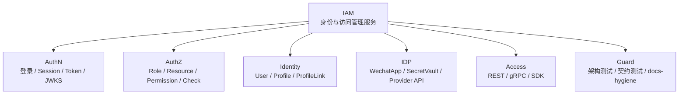

### 讲图台词

```text
我会先把 IAM 拆成六块：AuthN 管认证态，AuthZ 管访问权，Identity 管身份与档案关系，IDP 管第三方身份源，Access 管业务系统接入，Guard 管长期演进不漂移。
```

---

## A2. 普通用户中心 vs IAM

### 适用文档

```text
00-项目一句话定位.md
01-业务背景与问题.md
07-专题分析/01-为什么IAM不是普通用户中心.md
```

### 适合回答

```text
为什么不能说这是用户中心？
```

### Mermaid

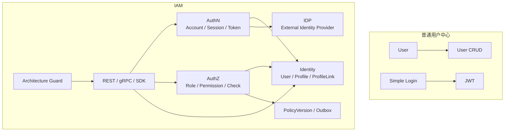

### 讲图台词

```text
普通用户中心的核心是 User CRUD，而 IAM 的核心是身份、认证、授权、会话、凭证、第三方身份源和系统接入。
```

---

# B. 系统架构图

## B1. 分层架构主图

### 适用文档

```text
02-系统架构讲法.md
11-30分钟技术分享脚本.md
```

### 适合回答

```text
项目整体架构是什么？
你怎么组织代码层次？
六边形架构体现在哪里？
```

### Mermaid

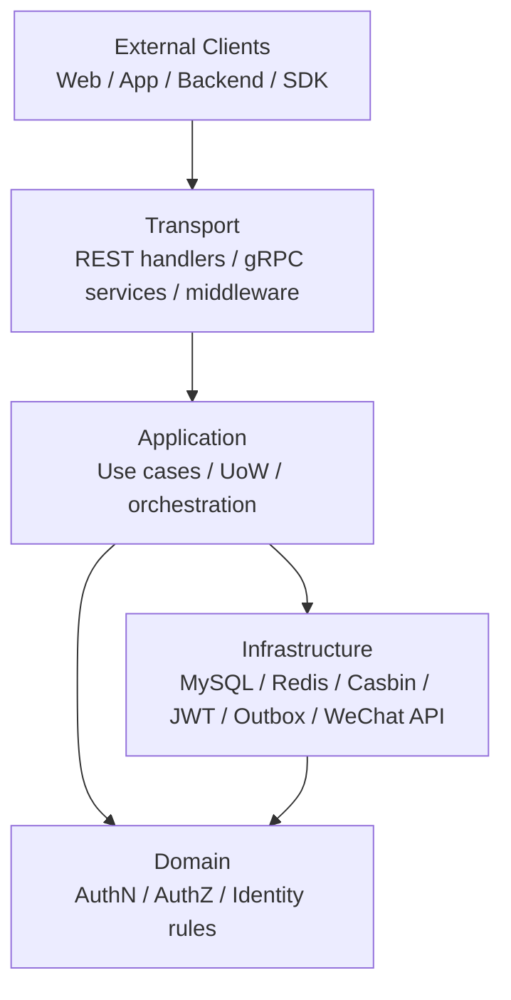

### 讲图台词

```text
Transport 只做协议适配，Application 负责编排用例和事务，Domain 承载业务规则，Infra 适配外部资源。核心逻辑不依赖 REST、gRPC、MySQL、Redis 或 Casbin 的具体实现。
```

---

## B2. 横向模块边界图

### 适用文档

```text
02-系统架构讲法.md
03-AuthN认证体系讲法.md
04-AuthZ授权体系讲法.md
05-Identity与ProfileLink讲法.md
06-IDP与第三方登录讲法.md
```

### 适合回答

```text
为什么拆 AuthN/AuthZ/Identity/IDP？
模块之间怎么协作？
```

### Mermaid

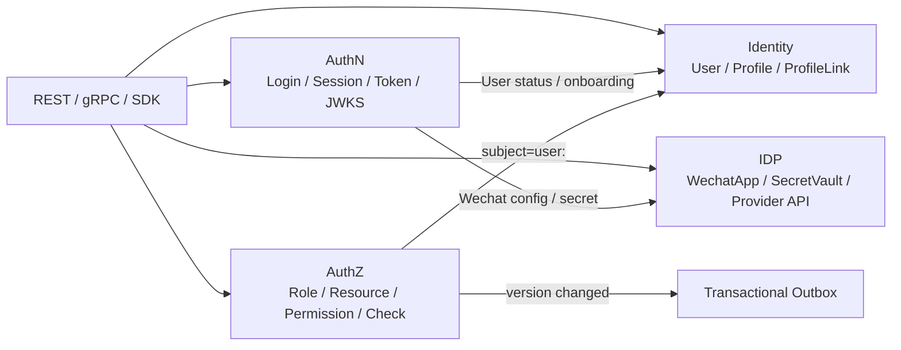

### 讲图台词

```text
AuthN、AuthZ、Identity、IDP 不是四个随便拆出来的目录，而是四类不同问题：认证态、访问权、身份关系和外部身份源。
```

---

## B3. 六边形架构图

### 适用文档

```text
02-系统架构讲法.md
10-工程质量与架构护栏讲法.md
```

### 适合回答

```text
你说用了六边形架构，哪里体现？
```

### Mermaid

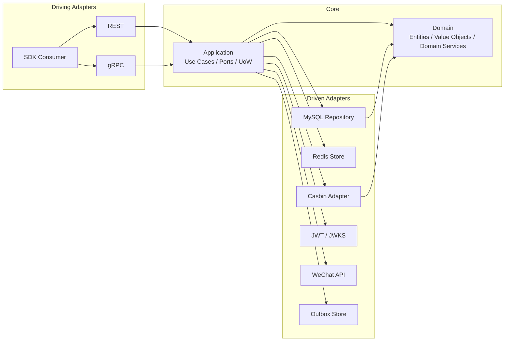

### 讲图台词

```text
REST/gRPC 是驱动适配器，MySQL/Redis/Casbin/JWT/微信 API 是被驱动适配器，中间的 Application/Domain 才是核心。
```

---

# C. 运行时装配图

## C1. 服务启动与组合根图

### 适用文档

```text
02-系统架构讲法.md
11-30分钟技术分享脚本.md
```

### 适合回答

```text
服务如何启动？
process 和 container 分别负责什么？
```

### Mermaid

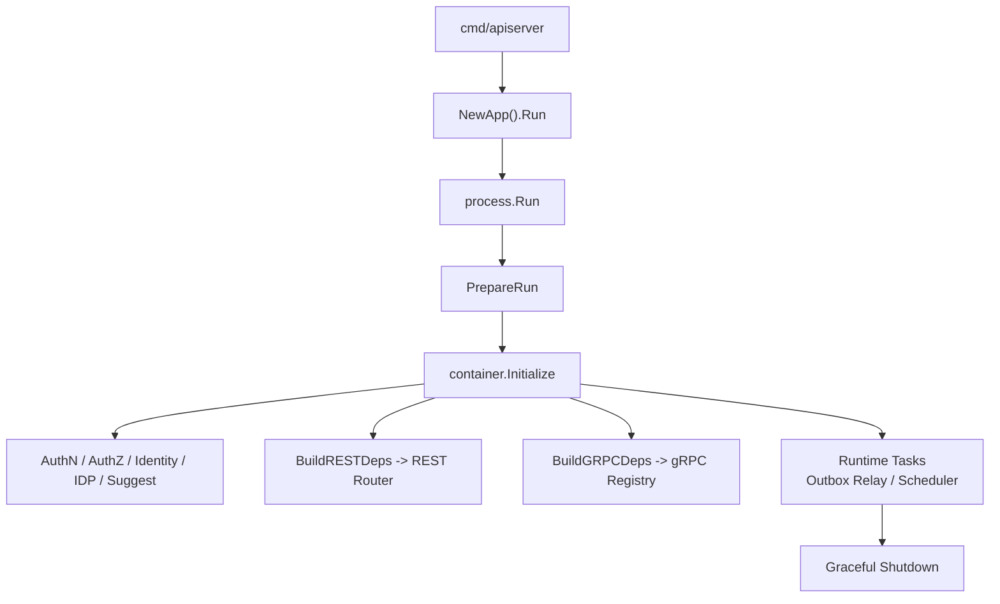

### 讲图台词

```text
main 很薄，process 负责生命周期，container 是组合根，模块能力最终投影给 REST、gRPC 和 runtime tasks。
```

---

## C2. Container 能力投影图

### 适用文档

```text
02-系统架构讲法.md
10-工程质量与架构护栏讲法.md
```

### 适合回答

```text
container 是不是 Service Locator？
REST/gRPC 怎么拿依赖？
```

### Mermaid

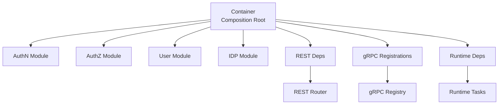

### 讲图台词

```text
container 只在启动阶段负责组装和能力投影，业务请求不会到 container 里随便取对象，所以它是 composition root，不是运行期 Service Locator。
```

---

# D. AuthN 认证链路图

## D1. AuthN 登录主链路

### 适用文档

```text
03-AuthN认证体系讲法.md
07-JWKS与Token安全讲法.md
11-30分钟技术分享脚本.md
```

### 适合回答

```text
登录流程怎么设计？
为什么不是直接发 JWT？
```

### Mermaid

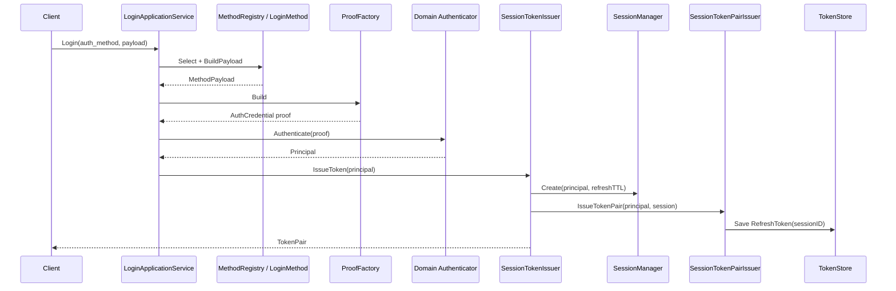

### 讲图台词

```text
不同登录方式通过 MethodRegistry、LoginMethod 和 ProofFactory 统一成 proof，认证成功后得到 Principal，再由 SessionTokenIssuer 创建 Session、SessionTokenPairIssuer 签发 token pair。
```

---

## D2. Session / Access / Refresh 分工图

### 适用文档

```text
03-AuthN认证体系讲法.md
07-JWKS与Token安全讲法.md
```

### 适合回答

```text
Access Token 和 Refresh Token 怎么分工？
为什么需要 Session？
```

### Mermaid

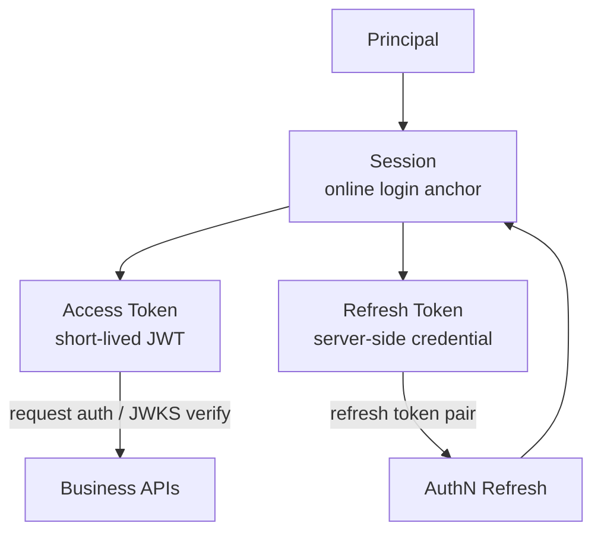

### 讲图台词

```text
Access Token 负责访问，Refresh Token 负责续期，Session 是二者共同绑定的在线登录态锚点。
```

---

## D3. 在线 Verify 链路图

### 适用文档

```text
03-AuthN认证体系讲法.md
07-JWKS与Token安全讲法.md
```

### 适合回答

```text
在线 Verify 比 JWT 验签多做什么？
```

### Mermaid

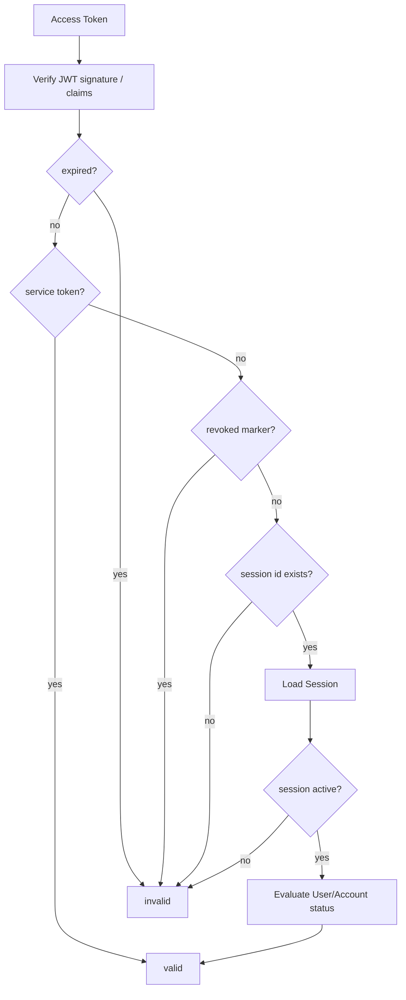

### 讲图台词

```text
本地验签只证明 JWT 签名可信，在线 Verify 还要证明 token 当前仍可用。
```

---

## D4. JWKS vs 在线 Verify

### 适用文档

```text
07-JWKS与Token安全讲法.md
03-AuthN认证体系讲法.md
```

### 适合回答

```text
JWKS 和在线 Verify 有什么区别？
```

### Mermaid

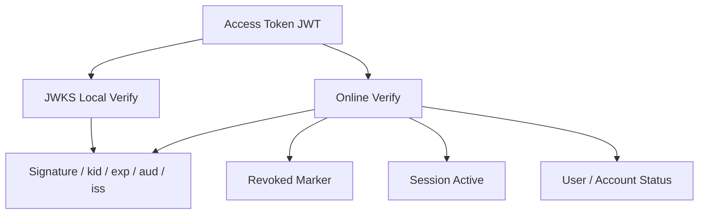

### 讲图台词

```text
JWKS 证明签名可信，在线 Verify 证明当前可用。两者不是替代关系。
```

---

## D5. KeyRotation 状态机

### 适用文档

```text
07-JWKS与Token安全讲法.md
```

### 适合回答

```text
JWKS 如何支持密钥轮换？
```

### Mermaid

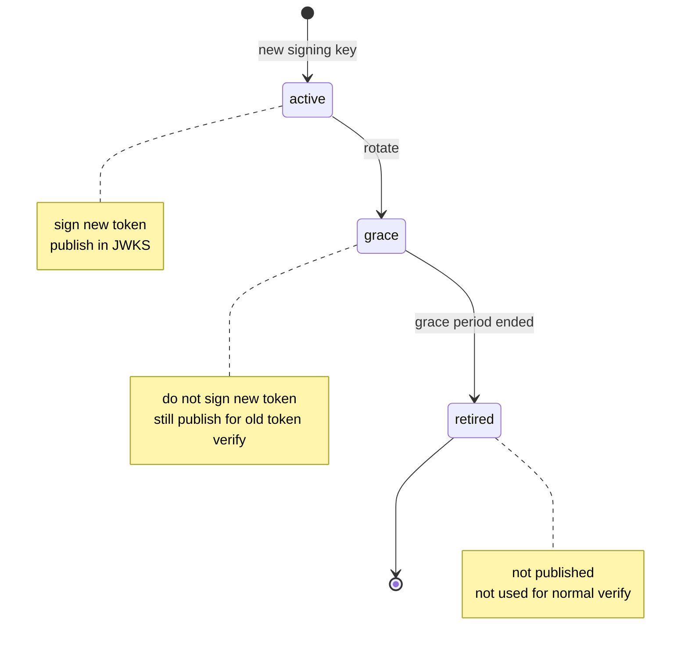

### 讲图台词

```text
active 负责签新 token，grace 负责验旧 token，retired 不再发布。这个状态机让 KeyRotation 平滑过渡。
```

---

# E. AuthZ 授权链路图

## E1. AuthZ 授权模型图

### 适用文档

```text
04-AuthZ授权体系讲法.md
08-Outbox与授权版本传播讲法.md
```

### 适合回答

```text
授权模型怎么设计？
为什么不用 user.role？
```

### Mermaid

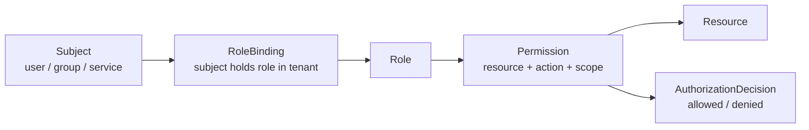

### 讲图台词

```text
subject 通过 RoleBinding 获得 role，role 通过 Permission 关联 resource/action/scope，最终得到授权判定。
```

---

## E2. AuthZ Check 链路图

### 适用文档

```text
04-AuthZ授权体系讲法.md
```

### 适合回答

```text
一次权限判定怎么走？
Casbin 在哪里？
```

### Mermaid

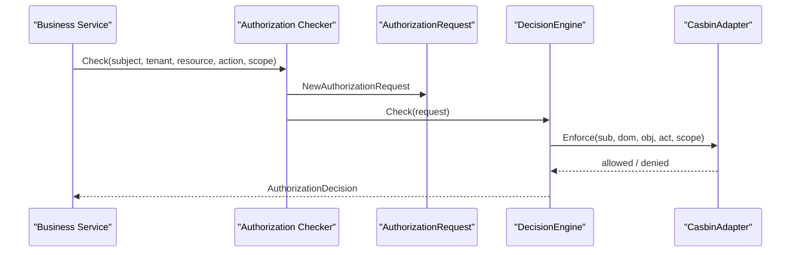

### 讲图台词

```text
业务服务不自己判断权限，而是把 subject、tenant、resource、action、scope 交给 AuthZ，由 runtime policy engine 判定。
```

---

## E3. AuthZ 写入链路图

### 适用文档

```text
04-AuthZ授权体系讲法.md
08-Outbox与授权版本传播讲法.md
```

### 适合回答

```text
授权写入为什么不是 CRUD？
```

### Mermaid

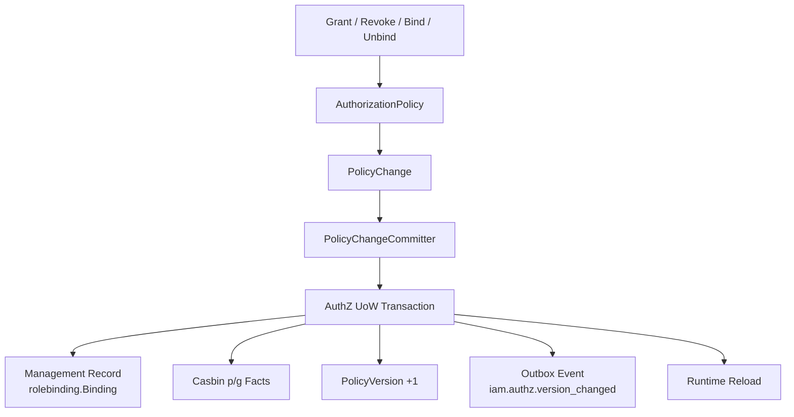

### 讲图台词

```text
授权写入改的是运行时策略事实，所以必须同时处理管理记录、p/g facts、PolicyVersion、Outbox 和 runtime reload。
```

---

## E4. Outbox 授权版本传播图

### 适用文档

```text
08-Outbox与授权版本传播讲法.md
04-AuthZ授权体系讲法.md
```

### 适合回答

```text
为什么授权版本传播需要 Outbox？
```

### Mermaid

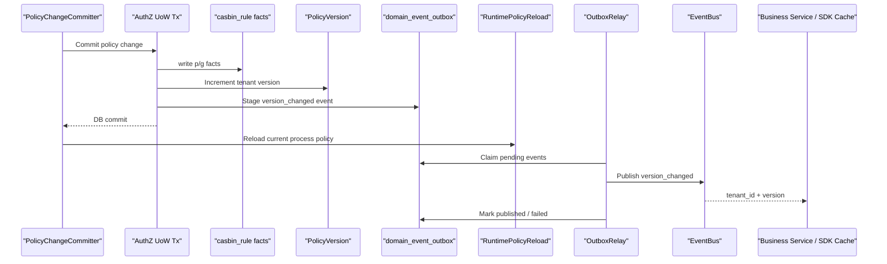

### 讲图台词

```text
授权 facts、PolicyVersion 和 outbox row 同事务提交；事件发布是事务后的异步可靠投递。
```

---

## E5. Outbox 状态机

### 适用文档

```text
08-Outbox与授权版本传播讲法.md
```

### 适合回答

```text
Outbox 怎么重试？
为什么消费者要幂等？
```

### Mermaid

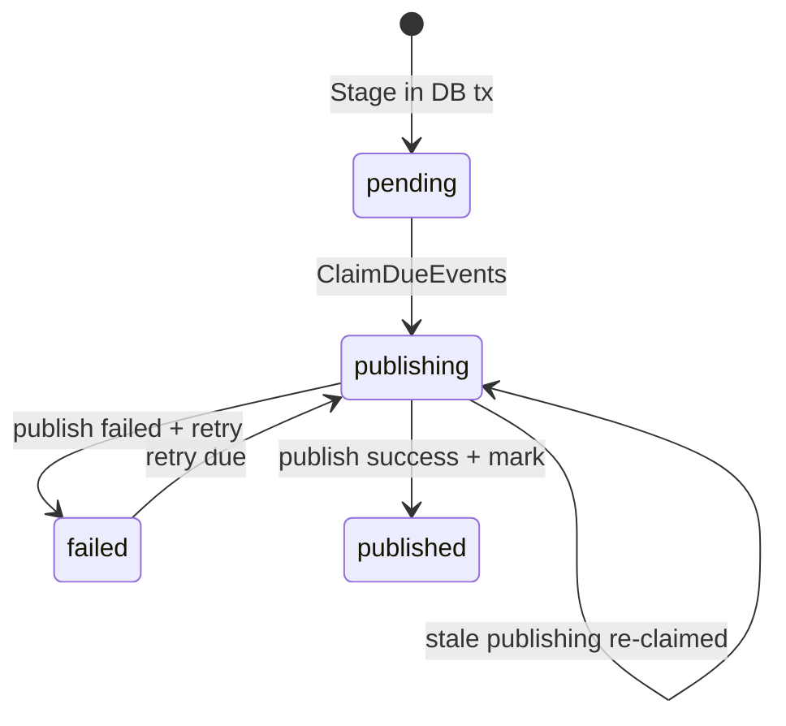

### 讲图台词

```text
Outbox 保证 at-least-once，不保证 exactly-once，所以消费者要按 event_id 或 tenant_id+version 幂等。
```

---

# F. Identity / ProfileLink 图

## F1. User / Profile / ProfileLink 图

### 适用文档

```text
05-Identity与ProfileLink讲法.md
07-专题分析/07-为什么ProfileLink不能只是User字段.md
```

### 适合回答

```text
为什么 User 和 Profile 要分开？
ProfileLink 为什么不能只是 User 字段？
```

### Mermaid

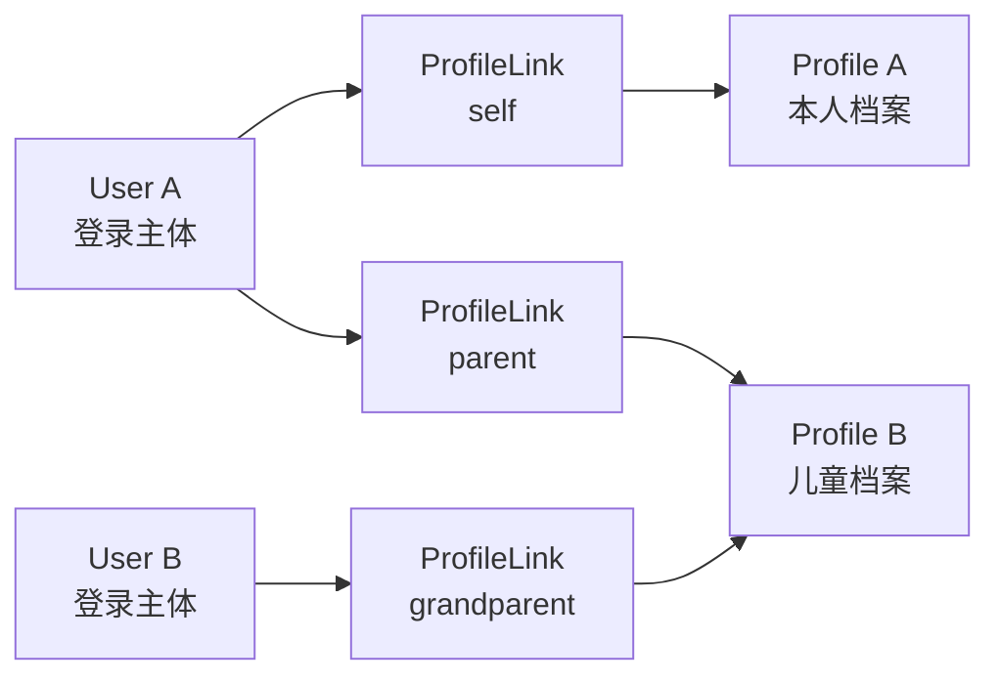

### 讲图台词

```text
User 是登录主体，Profile 是业务档案，ProfileLink 是二者之间的关系事实。它不是一对一字段，而是多对多关系边。
```

---

## F2. 当前用户 Profile 访问 guard 图

### 适用文档

```text
05-Identity与ProfileLink讲法.md
```

### 适合回答

```text
怎么防止用户访问别人的 Profile？
```

### Mermaid

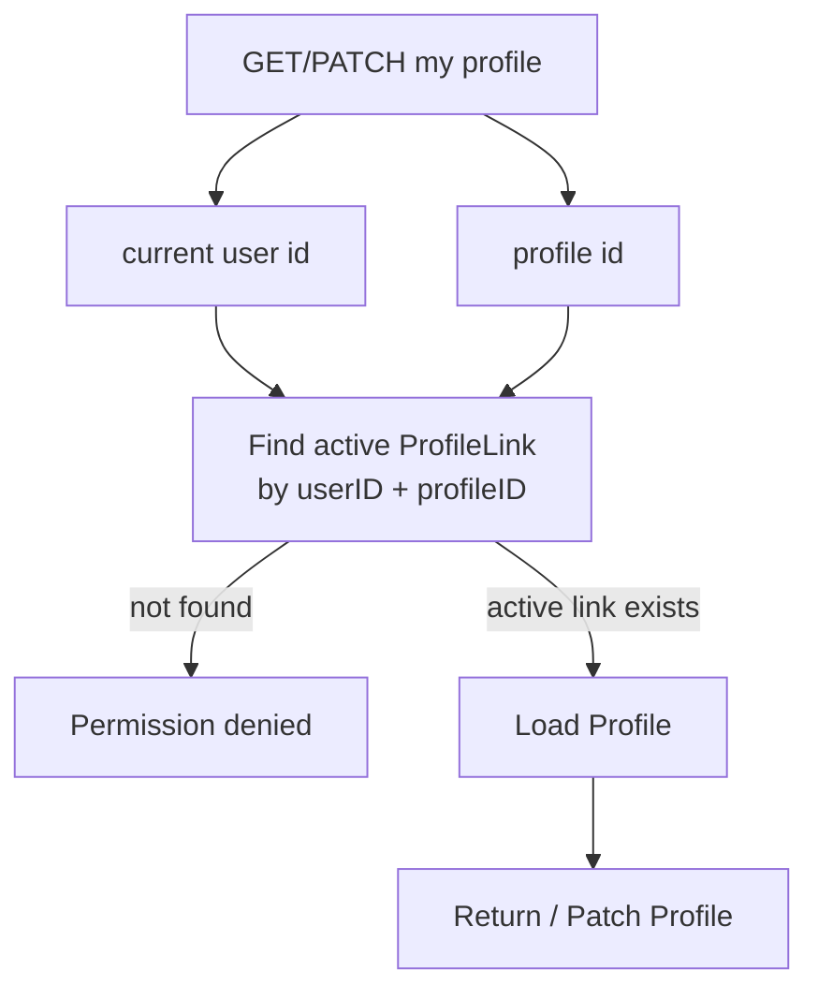

### 讲图台词

```text
当前用户不能直接按 profile_id 访问档案，必须先通过 active ProfileLink guard。
```

---

## F3. Identity 与 AuthN/AuthZ 边界图

### 适用文档

```text
05-Identity与ProfileLink讲法.md
03-AuthN认证体系讲法.md
04-AuthZ授权体系讲法.md
```

### 适合回答

```text
Identity 和 AuthN/AuthZ 怎么协作？
ProfileLink 是权限吗？
```

### Mermaid

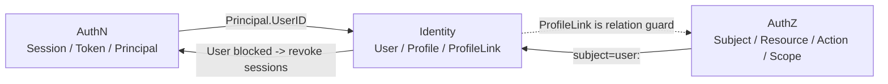

### 讲图台词

```text
Identity 提供 User 和 ProfileLink 上下文；AuthN 管登录态，AuthZ 管资源权限，ProfileLink 不是 AuthZ permission。
```

---

# G. IDP 与第三方登录图

## G1. IDP 与 AuthN 边界图

### 适用文档

```text
06-IDP与第三方登录讲法.md
03-AuthN认证体系讲法.md
```

### 适合回答

```text
IDP 和 AuthN 的边界是什么？
为什么 IDP 不签 IAM token？
```

### Mermaid

```mermaid
flowchart LR
    Client["Client<br/>wechat code / wecom auth_code"]
    AuthN["AuthN<br/>Login / Principal / Session / IAM Token"]
    IDP["IDP<br/>WechatApp / SecretVault / WeChat API"]
    WeChat["WeChat / WeCom Platform"]
    Token["IAM Token Pair<br/>Access + Refresh"]

    Client --> AuthN
    AuthN -->|"query app config"| IDP
    AuthN -->|"decrypt secret"| IDP
    AuthN -->|"code exchange"| IDP
    IDP --> WeChat
    AuthN -->|"authenticate + bind account"| AuthN
    AuthN --> Token
```

### 讲图台词

```text
IDP 只提供外部身份源基础设施，AuthN 仍然是 IAM 登录态和 token 的所有者。
```

---

## G2. 微信小程序登录链路图

### 适用文档

```text
06-IDP与第三方登录讲法.md
03-AuthN认证体系讲法.md
```

### 适合回答

```text
微信登录怎么接入 IAM？
code2Session 成功是不是登录成功？
```

### Mermaid

```mermaid
sequenceDiagram
    participant Client as "Mini Program"
    participant AuthN as "AuthN Login"
    participant Method as "Wechat LoginMethod"
    participant Proof as "ProofFactory"
    participant IDP as "IDP Repository / SecretVault"
    participant WeChat as "WeChat API"
    participant Token as "SessionTokenIssuer / SessionTokenPairIssuer"

    Client->>AuthN: login(app_id, js_code)
    AuthN->>Method: BuildPayload
    Method-->>AuthN: WechatPayload
    AuthN->>Proof: Build
    Proof->>IDP: GetByAppID(app_id)
    Proof->>IDP: Decrypt(AppSecretCipher)
    Proof->>WeChat: code2Session
    WeChat-->>Proof: openid / unionid
    Proof-->>AuthN: WechatMiniCredential
    AuthN->>AuthN: Account binding + Principal
    AuthN->>Token: IssueToken + IssueTokenPair
    Token-->>Client: IAM AccessToken + RefreshToken
```

### 讲图台词

```text
code2Session 只是外部身份校验，IAM 登录成功还要经过账号绑定、Principal、Session 和 Token 签发。
```

---

## G3. 双 access token 区分图

### 适用文档

```text
06-IDP与第三方登录讲法.md
07-JWKS与Token安全讲法.md
```

### 适合回答

```text
微信 access_token 和 IAM access token 是什么关系？
```

### Mermaid

```mermaid
flowchart TB
    WechatToken["WeChat access_token<br/>调用微信平台 API"]
    IAMToken["IAM access token<br/>访问 IAM / 业务系统"]
    IDP["IDP 管理"]
    AuthN["AuthN 管理"]
    WeChatAPI["WeChat API"]
    BusinessAPI["Business APIs / IAM APIs"]

    IDP --> WechatToken --> WeChatAPI
    AuthN --> IAMToken --> BusinessAPI
```

### 讲图台词

```text
名字都叫 access_token，但所属系统、用途和生命周期完全不同。
```

---

# H. 接入与工程护栏图

## H1. REST / gRPC / SDK 接入模型图

### 适用文档

```text
09-REST-gRPC-SDK接入讲法.md
11-30分钟技术分享脚本.md
```

### 适合回答

```text
为什么要同时提供 REST、gRPC、SDK？
```

### Mermaid

```mermaid
flowchart TD
    Web["Web / App / Admin UI"]
    Service["Backend Service / Worker"]
    GoService["Go Business Service"]

    REST["REST API<br/>OpenAPI"]
    GRPC["gRPC API<br/>Proto"]
    SDK["Go SDK<br/>接入产品层"]

    IAM["IAM Server<br/>AuthN / AuthZ / Identity / IDP"]

    Web --> REST --> IAM
    Service --> GRPC --> IAM
    GoService --> SDK
    SDK --> REST
    SDK --> GRPC
```

### 讲图台词

```text
REST、gRPC、SDK 是同一套 IAM 能力面向不同调用方的接入投影，不是三套业务逻辑。
```

---

## H2. 接入方式选择图

### 适用文档

```text
09-REST-gRPC-SDK接入讲法.md
```

### 适合回答

```text
什么场景用 REST？什么场景用 gRPC？什么场景用 SDK？
```

### Mermaid

```mermaid
flowchart LR
    Need["调用需求"]
    Login["用户登录 / 管理后台 / HTTP 调试"]
    S2S["服务间 Verify / AuthZ / Identity 查询"]
    GoApp["Go 服务接入 IAM"]

    REST["REST"]
    GRPC["gRPC"]
    SDK["SDK"]

    Need --> Login --> REST
    Need --> S2S --> GRPC
    Need --> GoApp --> SDK
```

### 讲图台词

```text
选择接入方式不是看哪种技术更高级，而是看调用方和场景。
```

---

## H3. SDK 封装关系图

### 适用文档

```text
09-REST-gRPC-SDK接入讲法.md
07-专题分析/10-为什么SDK是接入产品层而不是业务层.md
```

### 适合回答

```text
SDK 是什么层？
SDK 为什么不是业务层？
```

### Mermaid

```mermaid
flowchart TD
    SDK["sdk.NewClient"]
    Auth["Auth()<br/>Verify / Refresh / Revoke / JWKS"]
    Authz["Authz()<br/>Check / Allow / Snapshot"]
    Identity["Identity()<br/>User / Profile"]
    ProfileLink["ProfileLink()<br/>Query / Command"]
    IDP["IDP()<br/>GetWechatApp"]
    LoginV2["auth/loginv2<br/>REST Login"]
    JWKS["auth/jwks + verifier"]
    ServiceAuth["auth/serviceauth"]

    SDK --> Auth
    SDK --> Authz
    SDK --> Identity
    SDK --> ProfileLink
    SDK --> IDP

    LoginV2 --> REST["REST"]
    JWKS --> REST
    SDK --> GRPC["gRPC"]
    ServiceAuth --> Auth
```

### 讲图台词

```text
SDK 只是把 REST/gRPC/JWKS/ServiceAuth 封装成 Go 服务好用的 API，不定义 IAM 业务规则。
```

---

## H4. 工程护栏总图

### 适用文档

```text
10-工程质量与架构护栏讲法.md
06-架构护栏/*
```

### 适合回答

```text
你怎么保证系统长期不乱？
```

### Mermaid

```mermaid
flowchart TD
    Quality["工程质量与架构护栏"]

    Arch["架构测试<br/>依赖方向 / 分层边界"]
    REST["REST 契约<br/>路由 / OpenAPI"]
    GRPC["gRPC 契约<br/>proto / registration"]
    SDK["SDK 公开面<br/>compile test"]
    Docs["文档事实源<br/>docs-hygiene"]

    Quality --> Arch
    Quality --> REST
    Quality --> GRPC
    Quality --> SDK
    Quality --> Docs
```

### 讲图台词

```text
工程质量不是只靠业务测试，而是把架构边界、接口契约、SDK 公开面和文档事实源都做成自动化护栏。
```

---

## H5. 分层依赖护栏图

### 适用文档

```text
10-工程质量与架构护栏讲法.md
06-架构护栏/01-架构测试与依赖边界.md
```

### 适合回答

```text
architecture tests 保护什么？
```

### Mermaid

```mermaid
flowchart TD
    Transport["Transport<br/>REST / gRPC"]
    Application["Application<br/>Use Case / UoW"]
    Domain["Domain<br/>Business Rules"]
    Infra["Infra<br/>MySQL / Redis / Casbin / JWT"]
    Container["Container / Global Config"]

    Transport --> Application
    Application --> Domain
    Infra --> Domain

    Domain -. forbidden .-> Infra
    Domain -. forbidden .-> Transport
    Application -. forbidden .-> Transport
    Application -. forbidden .-> Infra
    Transport -. forbidden .-> Container
```

### 讲图台词

```text
架构测试保护的是依赖方向，不是目录洁癖。核心是业务规则向内，协议和基础设施向外。
```

---

## H6. 契约防漂移图

### 适用文档

```text
10-工程质量与架构护栏讲法.md
06-架构护栏/02-文档事实源与防漂移机制.md
```

### 适合回答

```text
如何防止 REST/gRPC/SDK 文档和代码不一致？
```

### Mermaid

```mermaid
flowchart LR
    RESTCode["Runtime REST Routes"]
    OpenAPI["api/rest OpenAPI"]
    RESTTest["router matrix / route contract"]

    Proto["api/grpc proto"]
    GRPCReg["gRPC service registration"]
    ProtoTest["proto contract test"]

    SDKAPI["pkg/sdk public API"]
    Compile["public API compile test"]

    RESTCode <--> RESTTest <--> OpenAPI
    Proto <--> ProtoTest <--> GRPCReg
    SDKAPI --> Compile
```

### 讲图台词

```text
REST、gRPC、SDK 各自有事实源和契约测试，不靠人工记忆维护一致性。
```

---

# I. 面试推荐 5 张核心图

如果是面试，建议只准备 5 张图：

```text
1. IAM 总定位图
2. 分层架构主图
3. AuthN 登录主链路图
4. AuthZ 授权模型 + 写入链路图
5. User/Profile/ProfileLink 图
```

原因：

| 图 | 面试价值 |
| --- | --- |
| IAM 总定位图 | 迅速说明项目不是用户中心 |
| 分层架构主图 | 展示工程架构能力 |
| AuthN 登录主链路图 | 展示认证与 token 安全理解 |
| AuthZ 授权模型 + 写入链路图 | 展示复杂业务建模与一致性 |
| User/Profile/ProfileLink 图 | 展示领域建模能力 |

如果还有时间，再补：

```text
JWKS vs 在线 Verify
Outbox 状态机
REST/gRPC/SDK 接入模型
工程护栏总图
```

---

# J. 30 分钟分享推荐图序

如果是 30 分钟技术分享，推荐图序：

```text
1. IAM 总定位图
2. 分层架构主图
3. 横向模块边界图
4. AuthN 登录主链路图
5. JWKS vs 在线 Verify 图
6. AuthZ 授权模型图
7. AuthZ 写入链路图
8. User/Profile/ProfileLink 图
9. IDP 与 AuthN 边界图
10. REST/gRPC/SDK 接入模型图
11. 工程护栏总图
```

时间不足时删掉：

```text
KeyRotation 状态机
Outbox 状态机
Container 能力投影图
当前用户 Profile guard 图
```

不要删：

```text
定位图
分层图
AuthN 图
AuthZ 图
ProfileLink 图
```

---

# K. 图的使用原则

## K1. 一张图只讲一个问题

错误：

```text
一张图塞进所有模块、所有表、所有接口、所有依赖。
```

正确：

```text
每张图只回答一个核心问题。
```

例如：

```text
AuthN 登录主链路图 -> 登录如何变成 token
JWKS vs Verify 图 -> 签名可信和当前可用的区别
ProfileLink 图 -> User/Profile 为什么不是一对一
```

---

## K2. 面试时少画细节，多画边界

面试官通常更关心：

```text
你怎么拆边界？
你为什么这么设计？
失败时怎么办？
这套设计如何演进？
```

不一定关心：

```text
每个 handler 名字
每个 DTO 字段
每个表字段
```

---

## K3. 不要画出你讲不清楚的东西

如果一张图里有：

```text
你没看过的源码
你不理解的模块
你无法解释的箭头
```

不要放进面试图里。

---

## K4. 图要能回链证据

每张图都应该能回链到：

```text
源码
OpenAPI
proto
SDK
测试
事实层文档
```

不要画“凭感觉”的图。

---

# 本文总结

`12-架构图素材索引.md` 的作用是：

```text
帮你把 IAM 项目的关键设计转成可讲、可画、可追问的图。
```

最重要的不是图多，而是图服务讲法。

IAM 对外宣讲建议永远围绕这条主线组织图：

```text
项目定位
  -> 系统架构
  -> AuthN
  -> AuthZ
  -> Identity
  -> IDP
  -> 接入
  -> 工程护栏
```

面试优先准备 5 张图：

```text
IAM 总定位图
分层架构主图
AuthN 登录主链路图
AuthZ 授权模型 / 写入链路图
User/Profile/ProfileLink 图
```

这 5 张图讲清楚，IAM 项目的核心能力、复杂度和工程价值就基本能讲出来。
