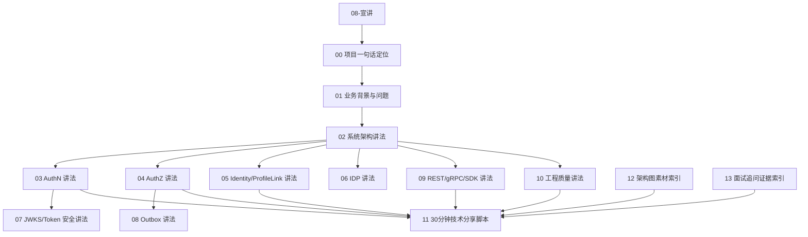

# 08-宣讲

## 本文回答

`08-宣讲/` 是 IAM 文档体系中的 **表达层与面试准备层**。

它不负责重新解释源码细节，也不负责替代事实层文档，而是回答：

```text
IAM 项目如何对外讲清楚？
面试时如何介绍项目？
30 分钟技术分享如何组织？
每个模块应该怎么讲？
架构图如何准备？
追问时如何回链证据？
```

如果说：

```text
00-06 是“系统事实”
07 是“设计取舍”
```

那么：

```text
08 是“如何表达”
```

本目录服务于：

```text
面试准备
技术分享
项目答辩
简历项目介绍
朋友/同事讲解
```

---

## 30 秒结论

`08-宣讲/` 的目标是把 IAM 从“我写了很多代码”转成一套清楚的表达：

```text
项目定位
  -> 业务背景
  -> 系统架构
  -> AuthN
  -> AuthZ
  -> Identity/ProfileLink
  -> IDP
  -> JWKS/Token 安全
  -> Outbox
  -> REST/gRPC/SDK
  -> 工程质量
  -> 30 分钟分享
  -> 架构图
  -> 面试追问
```

一句话：

> **宣讲模块不是事实层，而是把 IAM 的事实、取舍和证据链组织成可对外讲、可面试答、可技术分享的表达材料。**

---

## 本目录文档

当前 `08-宣讲/` 建议包含 14 篇文档：

```text
08-宣讲/
├── README.md
├── 00-项目一句话定位.md
├── 01-业务背景与问题.md
├── 02-系统架构讲法.md
├── 03-AuthN认证体系讲法.md
├── 04-AuthZ授权体系讲法.md
├── 05-Identity与ProfileLink讲法.md
├── 06-IDP与第三方登录讲法.md
├── 07-JWKS与Token安全讲法.md
├── 08-Outbox与授权版本传播讲法.md
├── 09-REST-gRPC-SDK接入讲法.md
├── 10-工程质量与架构护栏讲法.md
├── 11-30分钟技术分享脚本.md
├── 12-架构图素材索引.md
└── 13-面试追问证据索引.md
```

| 文档 | 作用 | 使用场景 |
| --- | --- | --- |
| `00-项目一句话定位.md` | 给 IAM 一个可背、可讲、可写简历的定位 | 面试开场、简历项目描述 |
| `01-业务背景与问题.md` | 解释为什么业务需要 IAM | 项目背景介绍 |
| `02-系统架构讲法.md` | 讲分层、模块、运行时和架构亮点 | 架构面试、技术分享 |
| `03-AuthN认证体系讲法.md` | 讲登录态、Session、Token、Verify | AuthN 深挖 |
| `04-AuthZ授权体系讲法.md` | 讲授权模型、Check、PolicyChange、Outbox | AuthZ 深挖 |
| `05-Identity与ProfileLink讲法.md` | 讲 User/Profile/ProfileLink 建模 | DDD/领域建模追问 |
| `06-IDP与第三方登录讲法.md` | 讲 IDP/AuthN 边界与微信/企微登录 | 第三方登录追问 |
| `07-JWKS与Token安全讲法.md` | 讲 JWT、JWKS、KeyRotation、Verify | Token 安全追问 |
| `08-Outbox与授权版本传播讲法.md` | 讲 PolicyVersion、Transactional Outbox、幂等 | 一致性和消息可靠性追问 |
| `09-REST-gRPC-SDK接入讲法.md` | 讲三层接入方式 | 接入与 SDK 追问 |
| `10-工程质量与架构护栏讲法.md` | 讲 architecture tests、contract tests、docs-hygiene | 工程质量追问 |
| `11-30分钟技术分享脚本.md` | 整合型分享讲稿 | 技术分享、项目答辩 |
| `12-架构图素材索引.md` | 可复用 Mermaid 图素材 | PPT、白板、Notion |
| `13-面试追问证据索引.md` | 问题 -> 回答 -> 证据 -> 展开 | 面试前冲刺 |

---

## 宣讲知识地图



---

## 推荐阅读顺序

### 面试准备顺序

```text
00-项目一句话定位
  -> 01-业务背景与问题
  -> 02-系统架构讲法
  -> 03-AuthN认证体系讲法
  -> 04-AuthZ授权体系讲法
  -> 05-Identity与ProfileLink讲法
  -> 07-JWKS与Token安全讲法
  -> 08-Outbox与授权版本传播讲法
  -> 13-面试追问证据索引
```

重点：

```text
先能讲清项目
再能讲清架构
再能讲清 AuthN/AuthZ/Identity 三条主线
最后准备追问
```

---

### 30 分钟技术分享准备顺序

```text
11-30分钟技术分享脚本
  -> 12-架构图素材索引
  -> 00-项目一句话定位
  -> 02-系统架构讲法
  -> 03-AuthN认证体系讲法
  -> 04-AuthZ授权体系讲法
  -> 10-工程质量与架构护栏讲法
```

重点：

```text
先拿完整脚本
再选图
最后补细节
```

---

### 简历项目描述准备顺序

```text
00-项目一句话定位
  -> 01-业务背景与问题
  -> 13-面试追问证据索引
```

重点：

```text
一句话定位
项目价值
技术亮点
可追问证据
```

---

### 架构答辩准备顺序

```text
02-系统架构讲法
  -> 10-工程质量与架构护栏讲法
  -> 12-架构图素材索引
  -> 13-面试追问证据索引
```

重点：

```text
分层
模块
边界
护栏
证据
```

---

## 宣讲主线

IAM 对外表达建议永远围绕这条主线：

```text
为什么需要 IAM
  -> IAM 如何拆分边界
  -> AuthN 如何管理登录态
  -> AuthZ 如何判定和传播权限
  -> Identity 如何表达档案关系
  -> IDP 如何接入第三方身份源
  -> REST/gRPC/SDK 如何服务业务系统
  -> 架构护栏如何保护长期演进
```

不要一上来堆：

```text
JWT
Casbin
Redis
gRPC
Outbox
DDD
```

正确顺序是：

```text
业务问题
  -> 领域边界
  -> 技术实现
  -> 工程取舍
  -> 证据链
```

---

## 最短项目定位

如果只允许说一句话：

```text
IAM 是一个面向业务系统接入的身份与访问管理服务，统一提供登录认证、Session 与 Token 管理、资源授权判定、User/Profile/ProfileLink 身份关系、第三方身份源集成，以及 REST/gRPC/SDK 接入能力。
```

如果只允许说 10 秒：

```text
IAM 不是普通用户中心，而是统一处理认证、授权、身份关系和业务系统接入的基础服务。
```

---

## 面试推荐 5 张图

来自 `12-架构图素材索引.md`，面试优先准备：

```text
1. IAM 总定位图
2. 分层架构主图
3. AuthN 登录主链路图
4. AuthZ 授权模型 / 写入链路图
5. User/Profile/ProfileLink 图
```

这 5 张图覆盖：

```text
项目定位
架构能力
认证安全
授权建模
领域建模
```

如果还有余力，再准备：

```text
JWKS vs 在线 Verify
Outbox 状态机
REST/gRPC/SDK 接入模型
工程护栏总图
```

---

## 面试追问主线

面试时最容易追问的方向：

| 方向 | 高频问题 |
| --- | --- |
| 项目定位 | 为什么不是普通用户中心？ |
| 架构 | 为什么分层？container 是不是 Service Locator？ |
| AuthN | 为什么不只用 JWT？Session 和 RefreshToken 怎么分工？ |
| Token 安全 | JWKS 和在线 Verify 有什么区别？KeyRotation 怎么做？ |
| AuthZ | 为什么不用 user.role？Casbin 是什么角色？ |
| AuthZ 写入 | 为什么不是 CRUD？PolicyVersion 和 Outbox 有什么用？ |
| Identity | User 和 Profile 为什么分开？ProfileLink 为什么不是字段？ |
| IDP | 为什么 IDP 不直接签 IAM Token？ |
| 接入 | REST/gRPC/SDK 怎么划分？SDK 为什么不是业务层？ |
| 工程质量 | 怎么防止系统越写越乱？ |

回答方式建议：

```text
结论
  -> 原因
  -> 当前设计
  -> 代码/契约/测试证据
  -> 代价和边界
```

---

## 宣讲文档与事实层的关系

宣讲文档不是事实源。

如果宣讲内容与事实层冲突，按以下优先级判断：

1. 源码和运行时行为；
2. OpenAPI / proto / SDK public API / configs / migrations；
3. 测试与架构护栏；
4. `00-06` 事实层文档；
5. `07` 专题分析；
6. `08` 宣讲表达；
7. `_archive` 历史材料。

宣讲文档要随事实层更新。  
不能为了表达顺滑而牺牲准确性。

---

## 与其他目录的关系

| 目录 | 关系 |
| --- | --- |
| `00-概览` | 提供系统定位与总图，宣讲模块从中提炼一句话定位和架构讲法 |
| `01-运行时` | 提供 process/container/transport 事实，宣讲模块转成架构白板讲法 |
| `02-认证AuthN` | 提供 AuthN 事实链路，宣讲模块转成认证体系讲法 |
| `03-授权AuthZ` | 提供 AuthZ 事实链路，宣讲模块转成授权体系讲法 |
| `04-身份Identity` | 提供 User/Profile/ProfileLink 事实，宣讲模块转成领域建模讲法 |
| `05-接入与契约` | 提供 REST/gRPC/SDK 事实，宣讲模块转成接入讲法 |
| `06-架构护栏` | 提供工程护栏事实，宣讲模块转成工程质量亮点 |
| `07-专题分析` | 提供设计取舍，宣讲模块转成面试可讲表达 |
| `_archive` | 历史材料，不作为当前宣讲证据源 |

---

## 常见误区

### 误区一：宣讲文档可以夸大系统能力

错误。  
宣讲应该准确表达当前事实，不能把规划能力说成已完成能力。

---

### 误区二：面试只需要背讲稿

错误。  
讲稿只能帮助组织语言。  
真正面试要能回链源码、契约和测试证据。

---

### 误区三：技术分享要把所有源码讲完

错误。  
30 分钟分享应该讲主线、边界和关键取舍，不应逐文件解释。

---

### 误区四：架构图越复杂越好

错误。  
一张图只回答一个问题。  
面试图以清楚为第一优先级。

---

### 误区五：只讲技术点，不讲业务问题

错误。  
技术点必须从业务问题和系统复杂度中自然引出。

---

## 维护规则

### 1. 宣讲内容必须能回链事实

每个亮点都应该能回链到：

```text
源码
OpenAPI
proto
SDK
测试
事实层文档
专题分析文档
```

不能讲没有证据的“高级能力”。

---

### 2. 宣讲文档不替代事实层

如果要修改事实，应去：

```text
00-06
```

如果要解释为什么，应去：

```text
07-专题分析
```

如果要改表达方式，才改：

```text
08-宣讲
```

---

### 3. 面试模板必须保留边界和代价

不要只写：

```text
设计亮点
```

还要写：

```text
为什么
代价
边界
追问
证据
```

---

### 4. 架构图要保持可讲

如果一张图你不能在 60 秒内讲清楚，就应该拆成两张图。

---

### 5. 不把 TODO 写成已完成

系统演进路线、未来扩展、多 IDP、多租户、管理后台等内容必须标注为：

```text
后续演进
设计方向
暂未完整实现
```

不能混入当前完成能力。

---

## 验证建议

修改宣讲文档后，建议运行：

```bash
make docs-hygiene
```

如果宣讲文档引用了源码路径、API 路径或 SDK 路径，建议同步检查：

```bash
go test ./internal/pkg/architecture
go test ./pkg/sdk/...
make api-validate
```

如果只是表达层修改，一般不需要跑全量业务测试，但必须保证：

```text
链接有效
术语准确
没有引用旧路径
没有把规划能力写成已实现能力
```

---

## 本文总结

`08-宣讲/` 是 IAM 的表达层。

核心心智是：

```text
00-06 讲事实
07 讲为什么
08 讲怎么表达
```

读完本目录后，读者应该能：

```text
用一句话介绍 IAM
用 30 秒讲项目定位
用 3 分钟讲系统架构
用 30 分钟做技术分享
用图讲清 AuthN/AuthZ/Identity/IDP
回答常见面试追问
把每个亮点回链到证据
```

如果只记一句话：

> **宣讲模块把 IAM 的系统事实、设计取舍和证据链组织成可对外表达、可面试追问、可技术分享的材料。**
