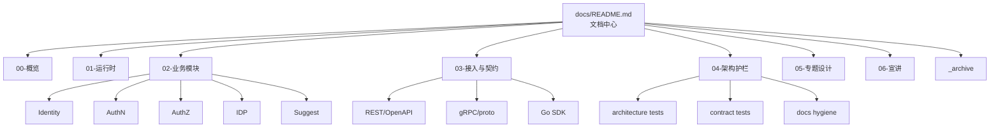

# IAM 文档中心

> 状态：待补证据 · 文档中心总入口；`make docs-hygiene` 已通过，架构/SDK 护栏文档已核对，其余业务模块与宣讲文档仍待逐项代码核对。

---

## 1. 30 秒结论

IAM 是面向业务系统接入的身份与访问管理服务。

它围绕 5 个核心问题组织能力：

```text
用户是谁？                  -> Identity
如何证明当前请求者是谁？      -> AuthN
用户能访问什么资源、执行什么动作？ -> AuthZ
外部 provider 说了什么？       -> IDP
当前请求者能搜索到哪些档案候选？ -> Suggest
```

`docs/` 是解释层和导航层，不是机器事实本身。

当前文档的核心事实层是：

```text
02-业务模块/
  -> 03-接入与契约/
  -> 04-架构护栏/
  -> 05-专题设计/
  -> 06-宣讲/
```

如果只记一句话：

> 代码、契约和测试是事实源；文档负责解释事实、组织阅读路径、沉淀设计边界和宣讲口径。

---

## 2. 文档中心定位

`docs/` 负责回答 6 类问题：

| 问题 | 对应目录 |
| --- | --- |
| IAM 是什么？边界是什么？怎么阅读？ | `00-概览/` |
| 服务如何启动、装配、运行？ | `01-运行时/` |
| Identity / AuthN / AuthZ / IDP / Suggest 分别是什么？ | `02-业务模块/` |
| REST / gRPC / Go SDK 如何接入？ | `03-接入与契约/` |
| 如何保证分层、契约、SDK、文档不漂移？ | `04-架构护栏/` |
| Token、Outbox、Casbin、ProfileLink、Suggest 等设计为什么这么做？ | `05-专题设计/` |
| 如何面试、评审、技术分享时讲清楚？ | `06-宣讲/` |

文档中心不负责：

```text
替代源码；
替代 OpenAPI/proto；
替代测试；
替代 CI；
用文档反向定义机器契约；
把历史归档内容作为当前事实源。
```

---

## 3. 事实源优先级

当文档、代码、契约、测试或历史材料冲突时，按下面顺序判断：

| 优先级 | 事实源 | 说明 |
| --- | --- | --- |
| 1 | 源码与运行时行为 | 当前实现和真实运行结果优先 |
| 2 | 机器可读契约与配置 | OpenAPI、proto、配置、迁移、生成源 |
| 3 | 测试 | 架构测试、契约测试、模块测试、SDK compile test |
| 4 | 现行 `docs/` 文档 | active 文档用于解释当前事实 |
| 5 | `_archive/` 历史材料 | 只用于追溯和迁移参考 |

关键规则：

```text
OpenAPI 是 REST 机器契约事实源；
proto 是 gRPC 机器契约事实源；
pkg/sdk 是 Go SDK public API 事实源；
internal/pkg/architecture 是分层依赖规则事实源；
_archive 不能作为当前事实源引用；
宣讲文档不能把待实现能力说成已实现事实。
```

---

## 4. 当前目录结构

```text
docs/
├── README.md
├── CONTRIBUTING-DOCS.md
├── 00-概览/
├── 01-运行时/
├── 02-业务模块/
│   ├── 01-Identity/
│   ├── 02-AuthN/
│   ├── 03-AuthZ/
│   ├── 04-IDP/
│   └── 05-Suggest/
├── 03-接入与契约/
├── 04-架构护栏/
├── 05-专题设计/
├── 06-宣讲/
└── _archive/
```

---

## 5. 目录说明

| 目录 | 作用 | 入口 |
| --- | --- | --- |
| `00-概览/` | IAM 定位、模块关系、术语、阅读路径、事实源 | [00-概览/README.md](00-概览/README.md) |
| `01-运行时/` | 服务入口、生命周期、组合根、REST/gRPC 装配、配置和后台任务 | [01-运行时/README.md](01-运行时/README.md) |
| `02-业务模块/` | Identity、AuthN、AuthZ、IDP、Suggest 的当前业务事实层 | [02-业务模块/README.md](02-业务模块/README.md) |
| `03-接入与契约/` | REST、gRPC、Go SDK 和业务系统接入方式 | [03-接入与契约/README.md](03-接入与契约/README.md) |
| `04-架构护栏/` | 分层依赖、架构测试、契约测试、SDK compile test、docs hygiene | [04-架构护栏/README.md](04-架构护栏/README.md) |
| `05-专题设计/` | JWT、Session/Token、Outbox、Casbin、ProfileLink、Suggest 的设计取舍 | [05-专题设计/README.md](05-专题设计/README.md) |
| `06-宣讲/` | 面试、技术分享、讲法脚本、图素材和追问证据链 | [06-宣讲/README.md](06-宣讲/README.md) |
| `_archive/` | 历史文档和重构前快照，不作为当前事实源 | [_archive/README.md](_archive/README.md) |

---

## 6. 文档地图



读图规则：

```text
00/01 建立全局背景和运行时入口；
02 是业务模块事实层；
03 是对外接入事实层；
04 是工程边界事实层；
05 是跨模块专题解释层；
06 是宣讲表达层；
_archive 只用于历史追溯。
```

---

## 7. 推荐阅读路径

### 7.1 新读者

```text
00-概览/README.md
  -> 00-概览/01-IAM系统定位.md
  -> 00-概览/02-模块划分与协作关系.md
  -> 02-业务模块/README.md
```

目标：先建立 IAM 的边界、模块关系和核心术语。

---

### 7.2 后端开发

```text
00-概览/04-阅读路径与事实源优先级.md
  -> 01-运行时/README.md
  -> 01-运行时/02-组合根与依赖装配.md
  -> 02-业务模块/README.md
  -> 04-架构护栏/01-分层依赖边界.md
```

目标：先看服务如何装配，再进入模块模型、链路和分层边界。

---

### 7.3 业务模块开发

```text
02-业务模块/README.md
  -> 02-业务模块/01-Identity/README.md
  -> 02-业务模块/02-AuthN/README.md
  -> 02-业务模块/03-AuthZ/README.md
  -> 02-业务模块/04-IDP/README.md
  -> 02-业务模块/05-Suggest/README.md
```

目标：按模块理解领域模型、关键链路、边界和代码索引。

---

### 7.4 接入方

```text
03-接入与契约/README.md
  -> 03-接入与契约/01-REST接入契约.md
  -> 03-接入与契约/02-gRPC接入契约.md
  -> 03-接入与契约/03-Go-SDK接入模型.md
  -> 03-接入与契约/04-业务系统接入IAM.md
```

目标：明确接入形态、契约事实源和防漂移规则。

---

### 7.5 架构与质量维护者

```text
04-架构护栏/README.md
  -> 04-架构护栏/01-分层依赖边界.md
  -> 04-架构护栏/02-架构测试.md
  -> 04-架构护栏/03-契约测试.md
  -> CONTRIBUTING-DOCS.md
```

目标：明确 import 方向、契约一致性、SDK 边界和文档卫生规则。

---

### 7.6 专题设计阅读

```text
05-专题设计/README.md
  -> 05-专题设计/01-JWT-JWS-JWK-JWKS-KeyRotation.md
  -> 05-专题设计/02-Session-AccessToken-RefreshToken边界.md
  -> 05-专题设计/03-Transactional-Outbox设计.md
  -> 05-专题设计/04-Casbin在AuthZ中的定位.md
  -> 05-专题设计/05-ProfileLink为什么不是Permission.md
  -> 05-专题设计/06-Suggest为什么是读模型.md
```

目标：理解 Token、会话、事件一致性、授权 runtime、身份关系和读模型等高风险概念边界。

---

### 7.7 宣讲与面试

```text
06-宣讲/README.md
  -> 06-宣讲/01-项目一句话定位.md
  -> 06-宣讲/02-系统架构讲法.md
  -> 06-宣讲/09-30分钟技术分享脚本.md
  -> 06-宣讲/10-架构图素材索引.md
  -> 06-宣讲/11-追问回链证据索引.md
```

目标：先用稳定讲法建立主线，再回链业务模块、专题设计和工程护栏。

---

## 8. 业务模块速览

| 模块 | 一句话 | 事实源 |
| --- | --- | --- |
| Identity | 身份事实中心，管理 User / Profile / ProfileLink | [02-业务模块/01-Identity/README.md](02-业务模块/01-Identity/README.md) |
| AuthN | 认证中心，管理 LoginIdentity / Credential / Principal / Session / Token | [02-业务模块/02-AuthN/README.md](02-业务模块/02-AuthN/README.md) |
| AuthZ | 授权中心，管理 Subject / Resource / Action / Scope / Role / Permission / RoleBinding / Check | [02-业务模块/03-AuthZ/README.md](02-业务模块/03-AuthZ/README.md) |
| IDP | 外部身份源基础设施，解析 ExternalIdentity | [02-业务模块/04-IDP/README.md](02-业务模块/04-IDP/README.md) |
| Suggest | Profile 联想搜索读模型，返回脱敏候选 | [02-业务模块/05-Suggest/README.md](02-业务模块/05-Suggest/README.md) |

核心边界：

```text
Identity 管身份事实；
AuthN 管认证结果；
AuthZ 管资源访问决策；
IDP 管外部身份事实解析；
Suggest 管搜索读模型；
五者不能互相替代。
```

---

## 9. 关键边界速查

| 易混概念 | 正确边界 |
| --- | --- |
| User vs LoginIdentity | User 是内部身份事实，LoginIdentity 是登录入口 |
| openid/unionid vs UserID | openid/unionid 是外部 provider 标识，不是内部 UserID |
| Principal vs Subject | Principal 是认证结果，Subject 是授权主体 |
| AuthN vs AuthZ | AuthN 证明是谁，AuthZ 判断能做什么 |
| AccessToken vs RefreshToken | AccessToken 访问 API，RefreshToken 只用于续期 |
| JWKS vs private key | JWKS 只发布公钥，不发布私钥 |
| ProfileLink vs Permission | ProfileLink 是身份关系，Permission 是访问权声明 |
| Casbin vs AuthZ domain | Casbin 是 infra runtime engine，不是领域模型 |
| Outbox vs MQ | Outbox 记录待发布事件，MQ 负责投递 |
| SuggestSnapshot vs Profile | SuggestSnapshot 是派生读模型，Profile 是 Identity 主数据 |
| SuggestResult vs AuthorizationDecision | SuggestResult 是候选展示，AuthorizationDecision 是授权决策 |
| docs vs machine contract | 文档解释语义，OpenAPI/proto/SDK 才是机器契约事实源 |

---

## 10. 维护规则

### 10.1 新增或修改业务模块文档

必须同步检查：

```text
02-业务模块/README.md 是否需要更新；
模块 README 是否需要更新；
03-接入与契约是否受影响；
04-架构护栏是否受影响；
05-专题设计是否需要补充设计取舍；
06-宣讲是否需要同步讲法和追问回链。
```

---

### 10.2 新增或修改 REST/gRPC/SDK 契约

必须同步检查：

```text
api/rest 或 api/grpc 机器契约；
transport/rest 或 transport/grpc 实现；
pkg/sdk public API；
03-接入与契约/README.md；
03-接入与契约/05-契约事实源与防漂移.md；
04-架构护栏/03-契约测试.md；
06-宣讲/11-追问回链证据索引.md。
```

---

### 10.3 合并、移动或删除文档

必须同步检查：

```text
所有 README 入口；
所有相对链接；
06-宣讲/10-架构图素材索引.md；
06-宣讲/11-追问回链证据索引.md；
_archive 是否需要保留历史快照；
make docs-hygiene 是否通过。
```

---

## 11. 旧入口处理说明

当前文档中心不再引用：

```text
02-业务模块/00-模块协作总图.md
```

原因：

```text
该内容已合并进 02-业务模块/README.md；
宣讲层的模块协作图已统一维护在 06-宣讲/10-架构图素材索引.md；
顶层 README 应引用当前 active 入口，不应继续引用旧骨架或已合并文档。
```

当前模块协作推荐入口：

```text
02-业务模块/README.md
06-宣讲/02-系统架构讲法.md
06-宣讲/10-架构图素材索引.md
```

---

## 12. 验证入口

### 12.1 文档最小验证

```bash
make docs-hygiene
```

---

### 12.2 涉及架构边界

```bash
go test ./internal/pkg/architecture
```

---

### 12.3 涉及 REST / gRPC / SDK 契约

```bash
make api-validate
make proto-gen
go test ./internal/apiserver/transport/rest/...
go test ./internal/apiserver/transport/grpc/...
go test ./pkg/sdk/...
```

---

### 12.4 涉及业务模块

按影响模块执行对应测试，例如：

```bash
go test ./internal/apiserver/domain/identity/...
go test ./internal/apiserver/application/identity/...
go test ./internal/apiserver/domain/authn/...
go test ./internal/apiserver/application/authn/...
go test ./internal/apiserver/domain/authz/...
go test ./internal/apiserver/application/authz/...
go test ./internal/apiserver/domain/idp/...
go test ./internal/apiserver/application/idp/...
go test ./internal/apiserver/domain/suggest/...
go test ./internal/apiserver/application/suggest/...
```

---

## 13. 本文总结

`docs/` 的阅读和维护主线是：

```text
先看 00/01 建立背景和运行时入口；
再看 02 掌握业务模块事实；
再看 03 掌握对外接入契约；
再看 04 掌握工程护栏；
再看 05 理解关键设计取舍；
最后看 06 形成可宣讲、可追问、可回链的表达体系。
```

最重要的工程规则是：

```text
文档不替代事实源；
active 不引用 archive 作为当前事实；
宣讲不新增事实；
链接、入口、Verify 必须可维护；
任何重命名、合并、删除都要同步 README 和 docs hygiene。
```