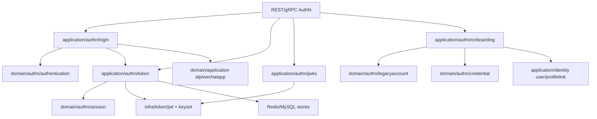
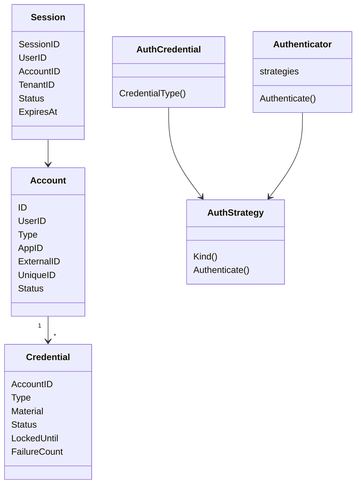
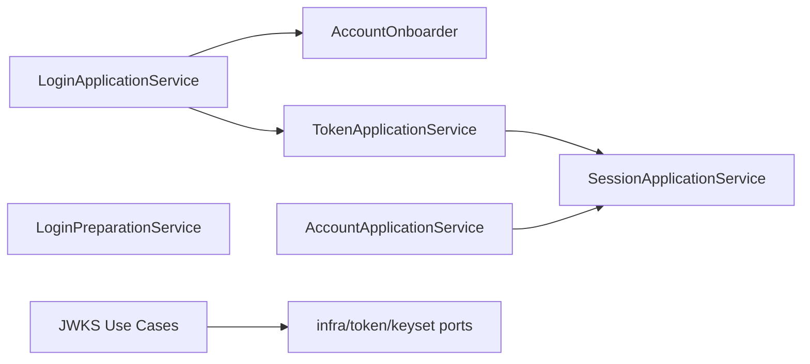
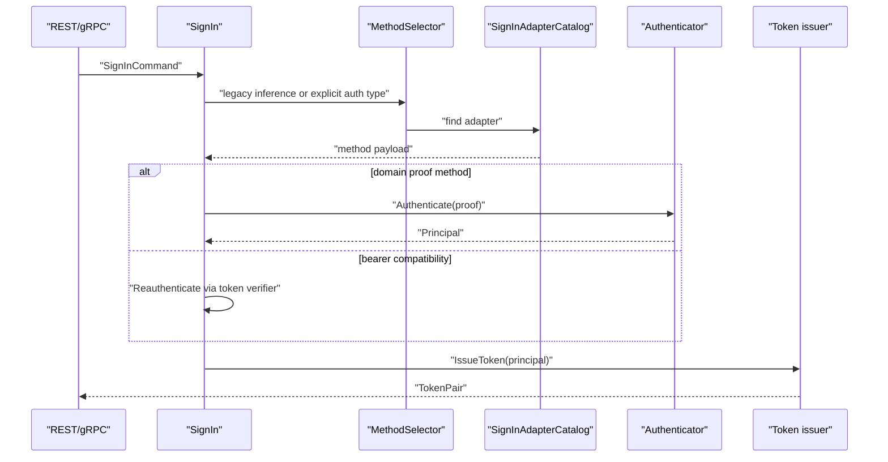
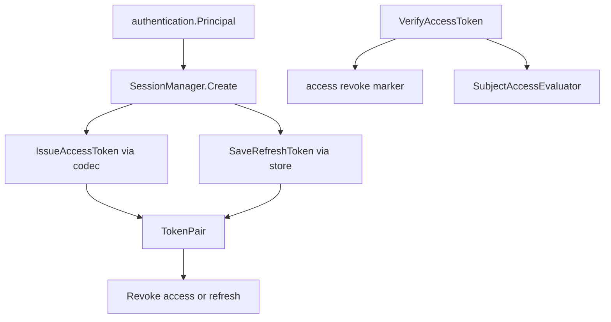
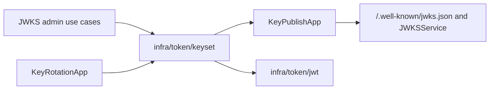

# AuthN：认证、Token 与 JWKS

## 本文回答

本文回答：IAM AuthN 域如何表达账户、凭据、登录策略、session、Token 与 JWKS/keyset；为什么认证规则放在 domain，登录与 token 生命周期放在 application；以及 AuthN 如何依赖 IDP 和 Identity，又不把 JWT/keyset 基础设施泄漏进领域层。

## 30 秒结论

- AuthN 的业务核心不是“一个登录 handler”，而是 Account、Credential、Authentication Strategy、Session、Token、JWKS 多个子能力的协作。
- Domain 层负责账户状态、凭据可用性、认证策略、session 访问状态等业务规则；Application 层负责登录方式选择、proof 构建、onboarding、token issue/refresh/verify/revoke 和 JWKS 用例。
- Access Token 是由 `application/authn/token` 编排、`infra/token/jwt` 编码的 JWT；Refresh Token 是应用层 token 模型并由存储端口保存。
- JWKS/keyset 的签名密钥生命周期在 `infra/token/keyset`，应用层只通过 JWKS use case 暴露发布、管理和轮换入口。
- `jwt_token` 是登录兼容方式，只存在于 application/transport 的适配层，不是 domain authentication strategy。
- AuthN 与 IDP 的关系是“登录 proof 需要外部身份换取结果”；AuthN 与 Identity 的关系是 onboarding 时创建或复用 User，并保证 self ProfileLink 不变量。

## 主图：AuthN 分层模型



## 重点速查

| 关注点 | 当前答案 | 代码证据 |
| ---- | ---- | ---- |
| 账户模型 | Account 表达外部/本地账号、绑定 User、状态和扩展信息。 | [../../internal/apiserver/domain/authn/legacyaccount](../../internal/apiserver/domain/authn/legacyaccount) |
| 凭据模型 | Credential 表达 password、OAuth、phone OTP 等凭据类型和可用性。 | [../../internal/apiserver/domain/authn/credential](../../internal/apiserver/domain/authn/credential) |
| 认证策略 | Authenticator 根据 CredentialType 选择 AuthStrategy。 | [../../internal/apiserver/domain/authn/authentication](../../internal/apiserver/domain/authn/authentication) |
| 登录应用服务 | LoginApplicationService 选择登录方式、构造 proof、调用认证并签发 token。 | [../../internal/apiserver/application/authn/login](../../internal/apiserver/application/authn/login) |
| Token 应用服务 | TokenApplicationService 暴露 issue、refresh、revoke、verify。 | [../../internal/apiserver/application/authn/token](../../internal/apiserver/application/authn/token) |
| JWKS 应用服务 | key management、key publish、key rotation use cases。 | [../../internal/apiserver/application/authn/jwks](../../internal/apiserver/application/authn/jwks) |
| Token 基础设施 | JWT codec 和 keyset lifecycle。 | [../../internal/apiserver/infra/token/jwt](../../internal/apiserver/infra/token/jwt)、[../../internal/apiserver/infra/token/keyset](../../internal/apiserver/infra/token/keyset) |
| 合同 | REST AuthN v1/v2 与 gRPC AuthService/JWKSService。 | [../../api/rest/authn.v2.yaml](../../api/rest/authn.v2.yaml)、[../../api/rest/authn.v2.yaml](../../api/rest/authn.v2.yaml)、[../../api/grpc/iam/authn/v2/authn.proto](../../api/grpc/iam/authn/v2/authn.proto) |

## 1. 领域模型



| 概念 | 业务含义 | 不变量/边界 |
| ---- | ---- | ---- |
| `Account` | 认证账号，是外部身份、本地账号与 IAM User 之间的锚点。 | 账号状态影响登录和 session 访问；账号创建由 account creator/onboarding 负责。 |
| `Credential` | 账号可用于认证的凭据。 | 凭据有类型、状态、锁定时间、失败次数；可用性由 usage/lifecycle/rotator 领域服务维护。 |
| `AuthCredential` | 一次认证请求中的 proof。 | password、phone OTP、WeChat、WeCom 各自有 proof 类型。 |
| `AuthStrategy` | 对某类凭据执行认证的领域策略。 | Domain 只知道凭据类型和认证决策，不知道 REST 字段名或 token 编码。 |
| `Session` | 登录成功后的认证会话。 | Access/Refresh Token 关联 session；用户或账号不可用会影响 verify/refresh。 |

## 2. 领域服务

| 领域服务 | 解决的问题 | 落地位置 |
| ---- | ---- | ---- |
| `Authenticator` | 多种凭据认证流程不能塞进一个 switch；按 credential type 选择策略。 | [../../internal/apiserver/domain/authn/authentication/authenticater.go](../../internal/apiserver/domain/authn/authentication/authenticater.go) |
| `AccountCreator` / `Editor` / `Lifecycler` | 账户创建、资料变更、状态变更需要统一规则。 | [../../internal/apiserver/domain/authn/legacyaccount](../../internal/apiserver/domain/authn/legacyaccount) |
| `Binder` / `Usage` / `Locker` / `Rotator` / `Lifecycle` | 凭据绑定、失败计数、锁定、轮换和启停各自是独立变化点。 | [../../internal/apiserver/domain/authn/credential](../../internal/apiserver/domain/authn/credential) |
| `SubjectAccessEvaluator` | Verify/Refresh 需要判断用户和账号当前是否仍可访问。 | [../../internal/apiserver/domain/authn/session/evaluator.go](../../internal/apiserver/domain/authn/session/evaluator.go) |

这些领域服务的共同边界是：它们处理认证业务规则，但不签 JWT、不发布 JWKS、不读取 Gin context、不知道 proto message。

## 3. 应用服务



| 应用服务 | 职责 |
| ---- | ---- |
| `LoginApplicationService` | 接收登录命令，选择登录方法，构造 method payload/proof，完成认证并签发 token pair。 |
| `LoginPreparationService` | 处理登录前准备，例如手机 OTP 发码。 |
| `AccountOnboarder` | 创建或复用 UC User，保证 self ProfileLink，再创建或复用 AuthN account/credential。 |
| `TokenApplicationService` | 为 transport 暴露服务令牌签发、刷新、撤销和在线 verify。 |
| `SessionApplicationService` | 管理 session 撤销，支撑管理端和账户状态变更副作用。 |
| `JWKS` use cases | 管理 key、发布 JWKS、触发/调度 key rotation。 |
| `AccountApplicationService` | 账号目录、profile 编辑、状态变更和 session 失效副作用。 |

## 4. 登录方式选择



登录选择分两层：

| 层 | 作用 | 设计原因 |
| ---- | ---- | ---- |
| `MethodSelector` | v1 legacy 字段推断或 v2 explicit `AuthType`。 | 保持旧调用兼容，同时让新合同显式选择登录方式。 |
| `SignInAdapterCatalog` | 按 auth type 找适配器，构造 method payload 或 proof。 | 新增登录方式时收敛在 adapter，不把字段判断散到应用服务主流程。 |

当前支持 password、phone OTP、WeChat mini program、WeCom 和 bearer-token compatibility。v2 合同只开放显式业务登录方式，兼容方式不作为新公开登录策略扩散。

## 5. Token 生命周期



| 操作 | 当前语义 |
| ---- | ---- |
| Issue session token pair | 创建 session，签发 access token，保存 refresh token。 |
| Issue service token | 签发服务间 access token，不返回 refresh token。 |
| Refresh | 读取 refresh token，校验 session 与 subject access，签发新 pair，删除旧 refresh。 |
| Verify | 校验 access token 编码、过期、撤销标记、session 和用户/账号状态。 |
| Revoke access | 标记 access token revoked；有 session id 时撤销对应 session。 |
| Revoke refresh | 删除 refresh token。 |

Access/Refresh/Service 都是 application token 模型；具体 JWT 编码、key id、签名算法属于 `infra/token/*`。

## 6. JWKS 与 Keyset



JWKS 的关键分工：

- Application/JWKS 提供“创建、查询、发布、轮换”的用例入口。
- `infra/token/keyset` 管 key material、PEM storage、key manager、rotation policy 和 publishable snapshot。
- `infra/token/jwt` 使用 key source 完成 access/service token 的编码与验签。
- REST public JWKS 和 gRPC `JWKSService` 只读发布结果；管理端路由必须走 admin middlewares。

## 7. 运行时与契约入口

| 接口面 | 能力 |
| ---- | ---- |
| REST v1 | `/api/v2/authn/login`、`/login/prep/phone-otp`、`/refresh_token`、`/logout`、`/verify`、signups、accounts、JWKS public/admin。 |
| REST v2 | `/api/v2/authn/login`，使用 explicit auth method。 |
| gRPC `AuthService` | Verify、Refresh、Revoke、RevokeRefresh、IssueServiceToken。 |
| gRPC `AccountOnboardingService` | 账户 onboarding。 |
| gRPC `JWKSService` | GetJWKS。 |

路由和服务注册由运行时层解释，业务语义以本篇的 application/domain 为准。

## 8. 设计模式

| 模式 | 为什么用 | IAM 中如何落地 | 代价和边界 |
| ---- | ---- | ---- | ---- |
| Strategy | 多种凭据认证差异大，但输出都是认证决策。 | `AuthStrategy` + `Authenticator`。 | 新策略需要注册进 domain authenticator。 |
| Adapter Catalog | REST/gRPC 字段形态和 domain proof 不一致。 | `SignInAdapterCatalog` 把 wire 输入转成 method payload/proof。 | adapter 不能承载认证规则，只做选择和转换。 |
| Application Service | 登录、onboarding、token 生命周期要跨多个领域对象和外部端口。 | `LoginApplicationService`、`TokenApplicationService`、`AccountOnboarder`。 | 应用服务编排流程，不拥有领域不变量。 |
| Repository/Port | 领域规则需要读取账号、凭据、session，但不能依赖数据库实现。 | domain repository interfaces 和 application ports。 | 端口要保持窄，否则 application 会知道过多 infra 细节。 |
| DTO/Mapper | transport 合同、应用输出、token claims 不应互相污染。 | request/result DTO、claim mapper、transport mapper。 | 映射代码增加，但合同稳定性更高。 |
| Cache/Store Port | Refresh token、revoke marker、session 需要可替换存储。 | `token.Store`、session manager、Redis adapter。 | 可用性和 TTL 语义必须由测试锁定。 |

## 9. 代码证据与验证

| 关注点 | 路径 |
| ---- | ---- |
| AuthN application 边界说明 | [../../internal/apiserver/application/authn/README.md](../../internal/apiserver/application/authn/README.md) |
| 登录选择与 adapter | [../../internal/apiserver/application/authn/login](../../internal/apiserver/application/authn/login) |
| Token lifecycle | [../../internal/apiserver/application/authn/token](../../internal/apiserver/application/authn/token) |
| JWKS use cases | [../../internal/apiserver/application/authn/jwks](../../internal/apiserver/application/authn/jwks) |
| 认证领域模型 | [../../internal/apiserver/domain/authn](../../internal/apiserver/domain/authn) |
| Token/JWKS 基础设施 | [../../internal/apiserver/infra/token](../../internal/apiserver/infra/token) |

验证命令：

```bash
go test ./internal/apiserver/domain/authn/... ./internal/apiserver/application/authn/... ./internal/apiserver/transport/rest/authn/... ./internal/apiserver/transport/grpc/service/authn
```
