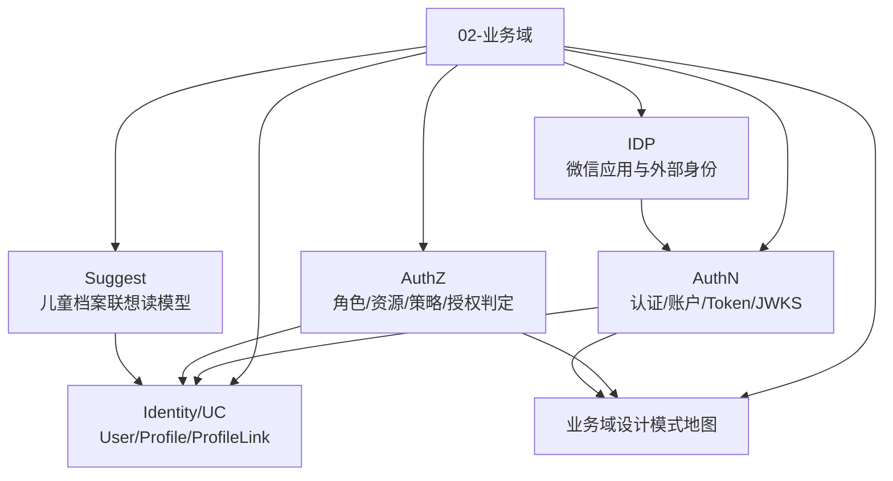
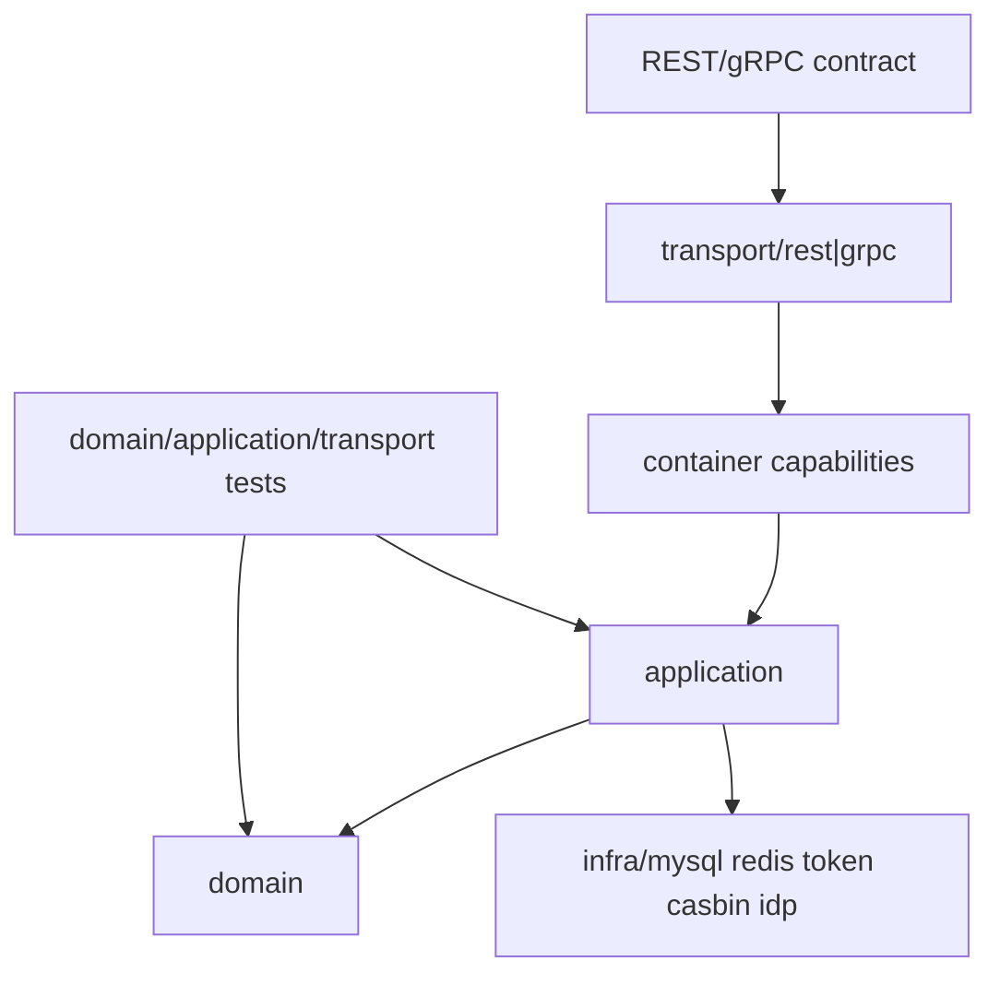

# 02-业务域

## 本文回答

本组文档回答：IAM 当前业务域如何划分，AuthN、AuthZ、Identity/ProfileLink、IDP、Suggest 各自负责什么，领域模型和应用服务如何组织，以及这些设计为什么使用当前的 DDD 分层和设计模式。

它承接 [00-概览](../00-概览/README.md) 的系统地图，也依赖 [01-运行时](../01-运行时/README.md) 中的 `process + container + transport` 装配事实。本组关注“业务能力本身”，不重复讲进程启动、mTLS、HTTP middleware 或 SDK 接入细节。

## 30 秒结论

- 当前业务域主体是 AuthN、AuthZ、Identity/UC、IDP/WechatApp、Suggest。
- Domain 层放业务概念、不变量和领域服务；Application 层放用例编排、事务边界、DTO/Mapper 和端口；Infra/Transport 不属于本层正文的权威叙事入口。
- `ProfileLink` 是当前代码和契约的标准术语，可解释为档案关系或监护关系语义，但不是法律监护判定引擎。
- AuthZ 内部以 `rolebinding` 表达主体和角色绑定；REST/proto 保留 `assignment` 作为公开 wire term。
- AuthN token 能力在 `application/authn/token`，JWT/keyset 基础设施在 `infra/token/jwt` 与 `infra/token/keyset`。
- 领域事件、授权版本和 outbox 行为以 [../../configs/events.yaml](../../configs/events.yaml)、AuthZ UoW 和 transactional outbox 为事实源。

## 业务域知识地图



## 文档地图

| 顺序 | 文档 | 读完应获得什么 |
| ---- | ---- | ---- |
| 1 | [01-authn-认证&Token&JWKS.md](01-authn-认证&Token&JWKS.md) | 理解账户、凭据、登录策略、session、Token、JWKS/keyset 的边界和协作。 |
| 2 | [02-authz-角色&策略&资源&Assignment.md](02-authz-角色&策略&资源&Assignment.md) | 理解 Subject/Role/Resource/Policy/RoleBinding、授权判定、快照和 outbox 版本事件。 |
| 3 | [03-user-用户&儿童&ProfileLink.md](03-user-用户&儿童&ProfileLink.md) | 理解 User、Profile、ProfileLink 的领域模型、self link 不变量和当前用户视角用例。 |
| 4 | [04-suggest-儿童联想搜索.md](04-suggest-儿童联想搜索.md) | 理解 Suggest 作为读侧辅助能力如何构建、刷新和查询档案候选。 |
| 5 | [05-idp-微信应用与外部身份.md](05-idp-微信应用与外部身份.md) | 理解 WechatApp、密钥轮换、access token cache-aside 以及它和 AuthN 登录的关系。 |
| 6 | [06-业务域设计模式地图.md](06-业务域设计模式地图.md) | 从设计模式角度串联各域为什么这样分层、如何解决复杂度和边界问题。 |

## 读者路径

| 读者 | 推荐路径 | 重点问题 |
| ---- | ---- | ---- |
| 新成员 | README -> AuthN -> Identity -> AuthZ | IAM 的主要业务对象是什么，为什么不是 handler 直接做业务。 |
| 后端开发 | 对应业务域文档 -> 模式地图 -> 代码锚点 | 新增用例时应放 domain、application 还是 transport。 |
| 接入方 | AuthN/AuthZ/Identity 对应章节 -> [../03-接口与集成](../03-接口与集成/README.md) | 合同名、wire term、业务语义和接入边界。 |
| 文档维护者 | README -> 每篇“代码证据与验证” | 文档事实如何回到代码、契约、迁移和测试。 |

## 模块边界总览

| 模块 | 负责 | 不负责 | 主要事实入口 |
| ---- | ---- | ---- | ---- |
| AuthN | 登录、账户、凭据、session、Access/Refresh Token、Service Token、JWKS。 | 资源权限判定、ProfileLink 关系规则、微信应用运维管理。 | [../../internal/apiserver/domain/authn](../../internal/apiserver/domain/authn)、[../../internal/apiserver/application/authn](../../internal/apiserver/application/authn) |
| AuthZ | 角色、资源、策略、rolebinding、PDP、授权快照、版本事件。 | 用户档案事实、认证凭据、HTTP JWT 提取。 | [../../internal/apiserver/domain/authz](../../internal/apiserver/domain/authz)、[../../internal/apiserver/application/authz](../../internal/apiserver/application/authz) |
| Identity/UC | User、Profile、ProfileLink、当前用户视角档案访问。 | 登录签发、角色策略、外部 IDP secret 管理。 | [../../internal/apiserver/domain/identity](../../internal/apiserver/domain/identity)、[../../internal/apiserver/application/identity](../../internal/apiserver/application/identity) |
| IDP/WechatApp | 微信应用配置、secret 轮换、access token 缓存和刷新。 | AuthN 登录结果签发、ProfileLink 关系写入。 | [../../internal/apiserver/domain/idp/wechatapp](../../internal/apiserver/domain/idp/wechatapp)、[../../internal/apiserver/application/idp/wechatapp](../../internal/apiserver/application/idp/wechatapp) |
| Suggest | 儿童档案联想搜索读模型、候选刷新、排名与去重。 | 权限判定、ProfileLink 建立或撤销、profile 写入。 | [../../internal/apiserver/domain/suggest](../../internal/apiserver/domain/suggest)、[../../internal/apiserver/application/suggest](../../internal/apiserver/application/suggest) |

## 分层事实源



事实冲突时按以下优先级处理：

1. domain/application 代码与测试。
2. REST/gRPC 合同、数据库迁移和配置。
3. container capabilities 与 transport registration。
4. 当前文档。
5. 归档材料。

## 本组不替代什么

- 不替代运行时：进程启动、HTTP protected routes、gRPC mTLS 在 [../01-运行时](../01-运行时/README.md)。
- 不替代接口接入：REST/gRPC/SDK 使用方式在 [../03-接口与集成](../03-接口与集成/README.md) 和 [../../pkg/sdk/docs/README.md](../../pkg/sdk/docs/README.md)。
- 不替代长链路专题：认证链、授权链、ProfileLink 链等跨层叙事在 [../05-专题分析](../05-专题分析/README.md)。
- 不替代历史材料：[../_archive](../_archive/README.md) 只用于追溯，不作为当前事实源。

## 维护验证

修改本组文档后至少运行：

```bash
make docs-hygiene
go test ./internal/apiserver/domain/... ./internal/apiserver/application/authn/... ./internal/apiserver/application/authz/... ./internal/apiserver/application/identity/... ./internal/apiserver/application/idp/... ./internal/apiserver/application/suggest
```

如新增 REST/gRPC 路由、service 或合同表，还要补跑：

```bash
go test ./internal/apiserver/transport/rest ./internal/apiserver/transport/grpc/...
```
