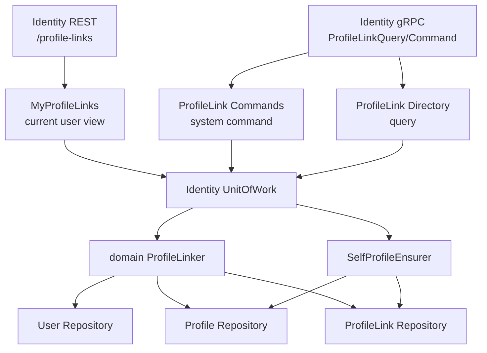
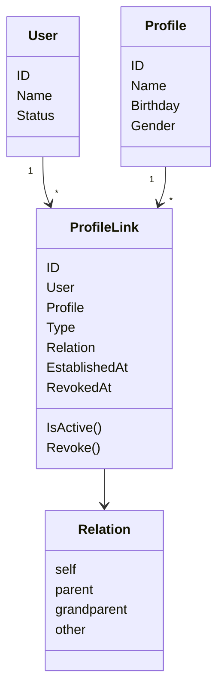
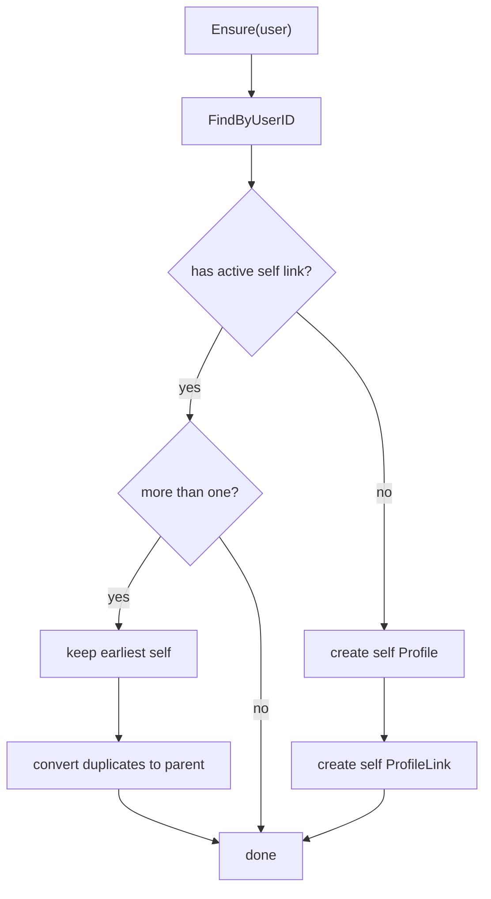
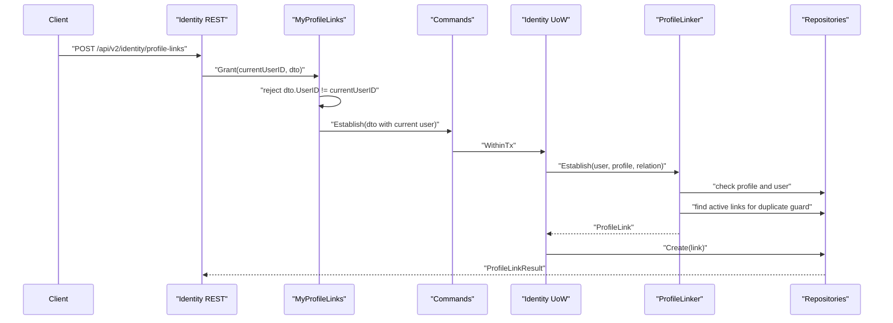
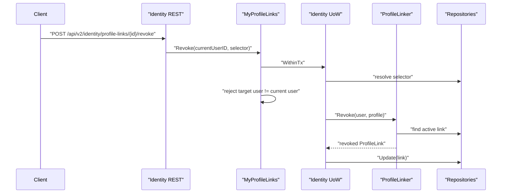
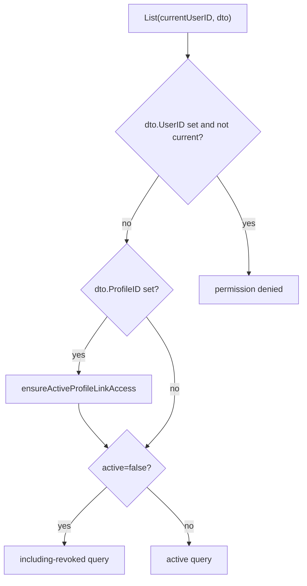

# ProfileLink 链路：用户与儿童档案关系协作

## 本文回答

本文回答：User、Profile、ProfileLink 如何在 IAM 中协作；为什么 self profile/link 是独立不变量；建立、撤销、查询 ProfileLink 时 domain service、application service、UoW 和 transport guard 如何分工；以及 ProfileLink 与 AuthZ、Suggest 的边界在哪里。

## 30 秒结论

- `ProfileLink` 是当前标准术语，表达 User 与 Profile 的档案关系，可承载监护关系语义，但不是法律监护判定引擎。
- self profile/link 是登录和当前用户视角的基础不变量，由 `SelfProfileEnsurer` 保障。
- 系统侧命令使用 `Commands.Establish/Revoke`；当前用户视角使用 `MyProfileLinks.Grant/List/Revoke`，后者会拒绝跨用户操作。
- 默认查询 active link；包含 revoked 的查询必须显式调用 including-revoked 能力或传入对应 active 参数。
- ProfileLink 不负责权限判定；资源访问仍应结合 AuthZ。Suggest 只提供候选，不写入关系。

## 主图：ProfileLink 协作模型



## 重点速查

| 关注点 | 当前事实 | 代码证据 |
| ---- | ---- | ---- |
| ProfileLink 领域模型 | User 与 Profile 的关系，含 Type、Relation、EstablishedAt、RevokedAt。 | [../../internal/apiserver/domain/identity/profilelink](../../internal/apiserver/domain/identity/profilelink) |
| 关系建立/撤销 | `ProfileLinker` 校验 user/profile 存在、active link 不重复，并返回待持久化实体。 | [../../internal/apiserver/domain/identity/profilelink/linker.go](../../internal/apiserver/domain/identity/profilelink/linker.go) |
| self 不变量 | `SelfProfileEnsurer` 确保用户有 active self link，并收敛重复 active self link。 | [../../internal/apiserver/domain/identity/profilelink/self_profile_ensurer.go](../../internal/apiserver/domain/identity/profilelink/self_profile_ensurer.go) |
| 应用命令 | `Commands` 用 UoW 包住建立和撤销。 | [../../internal/apiserver/application/identity/profilelink/service_command.go](../../internal/apiserver/application/identity/profilelink/service_command.go) |
| 当前用户视角 | `MyProfileLinks` 拒绝为其他用户 grant/list/revoke。 | [../../internal/apiserver/application/identity/profilelink/service_access.go](../../internal/apiserver/application/identity/profilelink/service_access.go) |
| REST 合同 | `/api/v2/identity/profile-links`。 | [../../api/rest/identity.v2.yaml](../../api/rest/identity.v2.yaml)、[../../internal/apiserver/transport/rest/identity](../../internal/apiserver/transport/rest/identity) |
| gRPC 合同 | `ProfileLinkQuery`、`ProfileLinkCommand`。 | [../../api/grpc/iam/identity/v2/identity.proto](../../api/grpc/iam/identity/v2/identity.proto)、[../../internal/apiserver/transport/grpc/service/identity](../../internal/apiserver/transport/grpc/service/identity) |

## 1. 领域模型：ProfileLink 不是 Profile 的字段



ProfileLink 独立成模型，是因为一个 Profile 可以被多个 User 关联，一个 User 也可以关联多个 Profile。把关系塞进 User 或 Profile 都会导致另一个方向查询变重，并且很难表达撤销历史。

## 2. self profile/link 不变量

`SelfProfileEnsurer` 解决的是“每个登录用户都应该有一个可作为自己身份档案的 self profile/link”。



如果历史数据中存在多个 active self link，当前逻辑保留最早的一条为 self，把后续重复 self link 转成 parent 关系。这是一个收敛不变量的领域服务，不是 transport 层的补丁。

## 3. 建立关系链路



`ProfileLinker.Establish` 不直接持久化。它只负责领域规则：

- profile 必须存在。
- user 必须存在。
- 同一 user/profile 不能已有 active link。
- relation 决定 link type。
- 返回待保存的 ProfileLink。

持久化发生在 application UoW 中，这让创建关系和读取 profile 结果处于同一事务边界。

## 4. 撤销关系链路

撤销不是物理删除，而是找到 active link 后调用 `Revoke(time.Now())`，再由 repository update。



当前用户视角的撤销会确认目标 link 属于当前用户，防止用户通过 link id 撤销别人的关系。

## 5. 查询链路与 active 默认值

`Directory` 提供系统侧查询；`MyProfileLinks` 提供当前用户视角查询。当前用户视角有两个重要 guard：

- 查询其他用户的 links 会被拒绝。
- 按 profile 查询前，需要确认当前用户与该 profile 有 active link。



默认 active 查询是为了让普通业务调用避开已经撤销的关系；需要审计或历史视图时才显式包含 revoked。

## 6. 与 AuthZ、Suggest 的边界

| 模块 | 与 ProfileLink 的关系 | 不应混淆 |
| ---- | ---- | ---- |
| AuthZ | 可基于用户、角色、资源和 scope 做权限判定。 | ProfileLink 不是资源权限判定引擎。 |
| Suggest | 给用户返回可能的 profile 候选。 | Suggest 不建立 ProfileLink，也不证明访问权。 |
| AuthN | 登录后可能确保 self profile/link。 | AuthN 不维护普通关系链路。 |
| IDP | 提供外部身份登录依赖。 | IDP 不决定用户和 profile 的业务关系。 |

## 7. 设计模式

| 模式 | 为什么用 | 解决的问题 | IAM 落地 | 代价和边界 |
| ---- | ---- | ---- | ---- | ---- |
| Domain Service | 建立/撤销关系跨 User、Profile、ProfileLink。 | 行为不属于单个实体。 | `ProfileLinker`、`SelfProfileEnsurer`。 | 领域服务不持久化，需应用层 UoW 配合。 |
| Unit of Work | 创建/撤销需要多 repository 协作。 | 防止部分写入。 | `application/identity/uow`。 | 查询路径不应变成复杂事务脚本。 |
| Guard/Policy Boundary | 当前用户视角必须限制 user scope。 | 防止跨用户查询或撤销。 | `MyProfileLinks`。 | 系统侧 gRPC command 仍需调用方具备外层授权。 |
| Soft Revoke | 关系撤销需要可追溯。 | 保留历史，同时默认隐藏 revoked。 | `RevokedAt` + active 默认查询。 | 调用方必须理解 active=false 的含义。 |
| Mapper | REST/gRPC 字段与 application DTO 不同。 | transport 术语不污染 domain。 | REST response、gRPC profile link mapper。 | mapper 需随合同维护。 |

## 8. 失败边界

| 场景 | 当前边界 |
| ---- | ---- |
| user/profile 不存在 | 建立关系失败。 |
| active link 已存在 | 建立关系失败，避免重复关系。 |
| 撤销时找不到 active link | 撤销失败。 |
| 当前用户试图 grant/list/revoke 其他用户关系 | 返回 permission denied。 |
| 按 profile 查询但当前用户不是 active link | 返回 permission denied。 |
| 多个 active self link | 保留最早 self，其余转换为 parent。 |

## 9. 代码证据与验证

核心入口：

- Domain：[../../internal/apiserver/domain/identity/profilelink](../../internal/apiserver/domain/identity/profilelink)
- Application：[../../internal/apiserver/application/identity/profilelink](../../internal/apiserver/application/identity/profilelink)
- Identity UoW：[../../internal/apiserver/application/identity/uow/uow.go](../../internal/apiserver/application/identity/uow/uow.go)
- REST Identity：[../../internal/apiserver/transport/rest/identity](../../internal/apiserver/transport/rest/identity)
- gRPC Identity：[../../internal/apiserver/transport/grpc/service/identity](../../internal/apiserver/transport/grpc/service/identity)

建议验证：

```bash
go test ./internal/apiserver/domain/identity/profilelink ./internal/apiserver/application/identity/profilelink ./internal/apiserver/transport/rest/identity ./internal/apiserver/transport/grpc/service/identity
```
