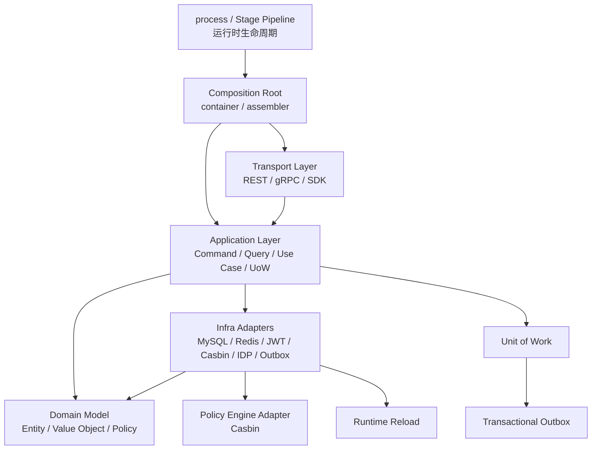
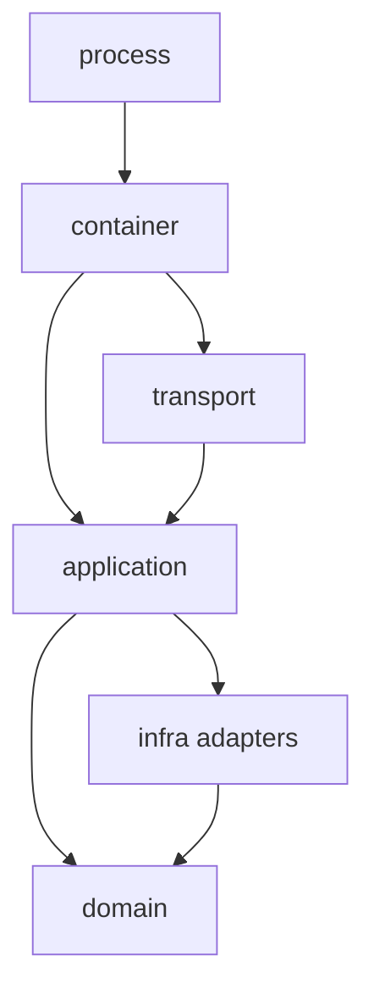

# 04-架构设计与模式导览

## 1. 本文定位

本文是 IAM 项目的架构设计与模式索引。

它不做抽象的设计模式科普，而是回答：

```text
IAM 当前使用了哪些架构模式？
这些模式分别解决什么问题？
它们在 IAM 代码中出现在哪里？
它们带来了什么收益？
它们有什么代价？
维护时应该避免哪些误用？
```

本文适合作为以下场景的入口：

```text
架构评审
代码重构
模块边界梳理
面试讲解
技术分享
```

如果要看具体模块实现，请继续阅读：

```text
01-运行时/
02-认证AuthN/
03-授权AuthZ/
04-身份Identity/
05-接入与契约/
06-架构护栏/
07-宣讲/
08-Suggest/
```

---

## 2. IAM 架构模式总览

当前 IAM 不是靠单一模式组织起来的，而是由多种工程模式共同支撑。

可以概括为：

```text
Ports & Adapters / Hexagonal Architecture
  -> 隔离业务核心与外部技术实现

Layered Architecture
  -> 约束 transport / application / domain / infra 的职责边界

Composition Root
  -> 集中装配 application service、repository、adapter、runtime task

Stage Pipeline
  -> 编排进程启动阶段和运行时准备流程

Domain Model / Value Object / Factory
  -> 承载业务不变量和领域语义

Strategy / Registry
  -> 支持多登录方式、多认证证明、多外部身份源扩展

Unit of Work
  -> 统一控制跨仓储事务边界

Transactional Outbox
  -> 保证业务事实与事件记录同事务提交

Policy Engine Adapter
  -> 将 AuthZ 领域模型映射到 Casbin runtime

Runtime Snapshot / Reload
  -> 支持授权事实投影、版本传播和运行时刷新
```

它们的关系可以画成：



这张图表达的是：

```text
运行时由 process 编排；
依赖由 container 集中装配；
请求从 transport 进入 application；
业务不变量在 domain；
外部资源由 infra adapter 实现；
事务和事件通过 UoW / Outbox 统一处理；
授权运行时通过 Casbin adapter 隔离技术细节。
```

---

## 3. Ports & Adapters / Hexagonal Architecture

### 3.1 解决什么问题

Ports & Adapters，也称 Hexagonal Architecture，核心目标是：

```text
让应用核心不直接依赖 UI、数据库、外部 API、消息系统等技术细节。
```

外部世界通过 adapter 进入应用，应用通过 port 表达自己需要的外部能力。

在 IAM 中，这个模式解决的问题是：

```text
AuthN 不直接依赖具体 JWT 库、Redis、短信供应商、微信 SDK。
AuthZ 不直接把 Casbin p/g facts 暴露为领域模型。
Identity 不直接让 transport 操作 MySQL。
application 依赖抽象能力，infra 提供具体实现。
```

---

### 3.2 IAM 中出现在哪里

典型位置：

```text
internal/apiserver/application
internal/apiserver/domain
internal/apiserver/infra
internal/apiserver/container/assembler
```

常见映射：

| Port / 期望能力 | Adapter / 实现 |
| --- | --- |
| Repository port | MySQL repository |
| Token signer/verifier | JWT/JWS adapter |
| Challenge store | Redis adapter |
| Decision engine | Casbin adapter |
| IDP client | WeChat / WeCom adapter |
| Outbox repository | MySQL outbox adapter |
| SMS sender | SMS provider adapter |

---

### 3.3 收益

```text
业务规则不被数据库和协议污染。
可以替换 infra 实现。
可以用 fake/mock adapter 做测试。
application 更接近用例语言。
domain 能维持纯净的不变量表达。
```

---

### 3.4 代价

```text
接口数量变多。
装配层会变厚。
简单 CRUD 场景会显得啰嗦。
如果 port 设计不稳定，会导致 adapter 跟着频繁变动。
```

---

### 3.5 误用警告

不要把 Ports & Adapters 理解成：

```text
所有东西都必须抽接口；
所有方法都要 repository port；
所有 DTO 都要转三遍；
所有模块都要机械套六边形图。
```

正确做法是：

```text
有外部技术边界、有可替换实现、有测试隔离诉求时，再明确抽 port。
```

---

## 4. Layered Architecture

### 4.1 解决什么问题

Layered Architecture 用于约束代码职责。

IAM 的主要分层是：

```text
transport
application
domain
infra
container
process
```

它解决的问题是：

```text
避免 handler 写业务规则；
避免 domain 依赖数据库；
避免 infra 反向决定业务语言；
避免 container 变成业务服务层；
避免 process 混入用例逻辑。
```

---

### 4.2 IAM 中的分层职责

| 层 | 职责 |
| --- | --- |
| `process` | 生命周期编排、资源准备、后台任务、优雅关闭 |
| `container` | 组合根、依赖装配、能力聚合、typed deps 生成 |
| `transport` | REST/gRPC 协议适配、DTO 映射、错误响应转换 |
| `application` | Command/Query、用例编排、事务边界、端口调用 |
| `domain` | Entity、Value Object、Policy、不变量、领域规则 |
| `infra` | MySQL、Redis、JWT、Casbin、IDP、Outbox、SMS 等技术适配 |

---

### 4.3 分层依赖图



需要注意：

```text
Infra -> Domain 通常表示 adapter 将持久化对象转换成 domain object。
不是说 infra 是业务上层。
业务规则仍然以 domain 为核心。
```

---

### 4.4 收益

```text
代码阅读路径清晰。
协议、用例、领域、基础设施边界清楚。
测试可以按层组织。
架构护栏可以检查依赖方向。
```

---

### 4.5 代价

```text
会增加目录和映射代码。
简单功能需要经过多层。
如果命名不统一，读者会迷路。
如果 application 过薄，可能退化成转发层。
如果 domain 过薄，可能退化成贫血模型。
```

---

## 5. Composition Root

### 5.1 解决什么问题

Composition Root 解决依赖在哪里创建、在哪里绑定、在哪里组合的问题。

如果没有组合根，常见问题是：

```text
handler 自己 new repository；
application 自己连接数据库；
domain 知道 Redis/JWT/Casbin；
测试难以替换依赖；
模块初始化顺序散落各处。
```

IAM 使用 `container` 和 `assembler` 集中完成依赖装配。

---

### 5.2 IAM 中出现在哪里

典型位置：

```text
internal/apiserver/container
internal/apiserver/container/assembler
```

它负责装配：

```text
AuthN capabilities
AuthZ capabilities
Identity capabilities
IDP capabilities
REST typed deps
gRPC typed deps
runtime tasks
repository adapters
token/cache/idp/casbin/outbox adapters
```

---

### 5.3 收益

```text
依赖创建集中。
模块能力边界清晰。
transport 不需要知道 infra 细节。
application service 可以通过构造参数获得所需能力。
测试可以替换依赖。
```

---

### 5.4 代价

```text
container/assembler 容易变厚。
装配代码容易变成大文件。
能力结构如果设计不好，会出现循环依赖。
```

---

### 5.5 误用警告

container 不是 service 层。

它不应该：

```text
处理请求；
写业务判断；
创建领域对象并执行业务规则；
直接实现登录、授权、ProfileLink 等用例。
```

container 只应该：

```text
创建对象；
绑定依赖；
暴露能力；
提供 runtime task；
把能力交给 transport/application 使用。
```

---

## 6. Stage Pipeline

### 6.1 解决什么问题

Stage Pipeline 用于把复杂启动流程拆成可理解、可测试、可诊断的阶段。

IAM 服务启动不是简单：

```text
main -> listenAndServe
```

而是需要依次完成：

```text
配置加载
运行模式判断
MySQL / Redis / EventBus 等资源准备
IDP encryption key 检查
container bootstrap
REST/gRPC 注册
后台任务启动
health/debug 能力准备
shutdown hook 注册
```

Stage Pipeline 让这些步骤有明确顺序和失败边界。

---

### 6.2 IAM 中出现在哪里

典型位置：

```text
internal/apiserver/process
```

配套文档：

```text
docs/01-运行时/01-服务入口与生命周期装配.md
docs/01-运行时/03-配置与运行模式.md
docs/01-运行时/04-后台任务与优雅关闭.md
docs/01-运行时/05-降级启动与健康检查.md
```

---

### 6.3 收益

```text
启动流程可读。
失败阶段可定位。
降级启动有边界。
测试可以针对单个 stage。
新增运行时资源时不必污染 main。
```

---

### 6.4 代价

```text
启动链路比普通 main 函数复杂。
state 对象需要维护清晰。
stage 顺序必须谨慎设计。
错误处理不能过度吞掉失败。
```

---

## 7. Domain Model / Value Object / Factory

### 7.1 解决什么问题

Domain Model 用于让业务概念承载规则，而不是只做数据结构。

Value Object 用于表达有语义、有校验、有不可变倾向的小对象。

Factory 用于集中创建复杂领域对象，并保证不变量。

在 IAM 中，这个模式解决的问题是：

```text
避免 Role、Resource、Permission、RoleBinding 只是贫血 struct；
避免 ResourceKey、Scope、Subject 只是字符串；
避免 LoginIdentity、Credential、Challenge 缺少生命周期约束；
避免 ProfileLink 退化成 user.profile_id 字段。
```

---

### 7.2 IAM 中出现在哪里

典型位置：

```text
internal/apiserver/domain/authn
internal/apiserver/domain/authz
internal/apiserver/domain/identity
internal/apiserver/domain/idp
```

AuthZ 中尤其明显：

```text
internal/apiserver/domain/authz/subject
internal/apiserver/domain/authz/tenant
internal/apiserver/domain/authz/role
internal/apiserver/domain/authz/resource
internal/apiserver/domain/authz/scope
internal/apiserver/domain/authz/permission
internal/apiserver/domain/authz/rolebinding
internal/apiserver/domain/authz/decision
internal/apiserver/domain/authz/policy
```

---

### 7.3 例子：ResourceKey 四段结构

AuthZ 的 ResourceKey 不再是随便的字符串。

它被约束为：

```text
<app>:<domain>:<type>:<name-or-pattern>
```

这属于典型 Value Object 设计：

```text
在创建时校验格式；
通过方法暴露 app/domain/type 等语义；
阻止非法 wildcard 进入领域对象；
把资源命名规则集中在 domain，而不是散落在 handler 或 SQL 中。
```

---

### 7.4 收益

```text
业务不变量集中。
非法状态更难进入系统。
代码表达更贴近业务语言。
测试可以聚焦领域规则。
后续重构时语义边界更稳定。
```

---

### 7.5 代价

```text
代码量增加。
对象创建需要处理 error。
需要区分领域对象、DTO、PO。
简单字段也可能需要显式转换。
```

---

### 7.6 误用警告

不要把所有字段都强行做成复杂 Value Object。

适合成为 Value Object 的通常是：

```text
有明确业务语义；
有格式约束；
需要归一化；
需要比较；
需要阻止非法值扩散；
会被多个用例共享。
```

---

## 8. Strategy / Registry

### 8.1 解决什么问题

Strategy 用于处理同一用例下的多种算法或多种实现。

Registry 用于把策略注册起来，再根据请求上下文选择策略。

IAM 中最典型的场景是 AuthN：

```text
password login
phone otp login
wechat login
wecom login
```

这些登录方式的流程相似，但证明材料、校验方式和外部依赖不同。

---

### 8.2 IAM 中出现在哪里

典型位置：

```text
internal/apiserver/application/authn/login
internal/apiserver/application/authn/onboarding
internal/apiserver/application/authn/linking
internal/apiserver/infra/idp
```

常见角色：

```text
MethodSelector
ProofFactory
Authenticator
AuthStrategy
IDP adapter
```

---

### 8.3 收益

```text
避免 login service 变成巨大 switch。
新增登录方式时影响范围可控。
不同认证方式可以独立测试。
Proof 构造和认证策略可以分离。
```

---

### 8.4 代价

```text
抽象层增加。
策略注册顺序和命名需要管理。
如果策略接口设计过宽，会导致实现臃肿。
如果策略接口设计过窄，会导致上下文到处补丁。
```

---

### 8.5 误用警告

不要为了“看起来可扩展”提前抽象所有策略。

适合使用 Strategy 的条件是：

```text
确实存在多种实现；
它们共享统一用例入口；
差异集中在某个算法或适配点；
未来扩展概率较高；
可以通过统一接口表达输入输出。
```

---

## 9. Unit of Work

### 9.1 解决什么问题

Unit of Work 用于管理一个用例中多个持久化操作的事务边界。

IAM 中很多写操作都不是单表写入。

例如：

```text
AuthN Onboarding 可能同时创建 User、LoginIdentity、Credential。
AuthZ 授权写入可能同时修改管理记录、runtime facts、PolicyVersion、Outbox Event。
Identity 可能同时维护 User、Profile、ProfileLink。
```

如果每个 repository 自己提交事务，就很难保证整体一致性。

---

### 9.2 IAM 中出现在哪里

典型位置：

```text
internal/apiserver/application/authn/uow
internal/apiserver/application/authz/uow
internal/apiserver/application/identity/uow
internal/apiserver/infra/mysql/uow
```

---

### 9.3 收益

```text
事务边界集中在 application。
多个 repository 写入可以同事务提交。
用例语义比底层 SQL 更清晰。
可以避免半成功状态。
```

---

### 9.4 代价

```text
UoW 接口设计复杂。
事务内外边界必须谨慎。
不能把远程 API 调用放进数据库事务。
需要处理并发、幂等和回滚语义。
```

---

### 9.5 误用警告

不要把 UoW 当成“万能 service”。

UoW 只负责事务边界和仓储协作，不应该承载领域判断。

领域判断应该在：

```text
domain model
domain policy
application use case
```

---

## 10. Transactional Outbox

### 10.1 解决什么问题

Transactional Outbox 解决的是双写一致性问题。

典型问题是：

```text
数据库事务提交成功，但消息发布失败。
消息发布成功，但数据库事务回滚。
服务在提交后、发布前崩溃。
```

在 IAM 中，这个问题主要出现在授权版本传播场景：

```text
授权事实发生变化；
PolicyVersion 需要递增；
下游或其他实例需要感知授权版本变化；
事件必须和授权事实保持一致。
```

---

### 10.2 IAM 中出现在哪里

典型位置：

```text
internal/apiserver/application/authz/policy
internal/apiserver/application/authz/uow
internal/apiserver/infra/mysql/policy
internal/apiserver/infra/mysql/uow
internal/apiserver/infra/outbox
```

配套文档：

```text
docs/03-授权AuthZ/04-授权版本与事件传播链路-PolicyVersion-Outbox-RuntimeReload.md
docs/07-宣讲/08-Outbox与授权版本传播讲法.md
```

---

### 10.3 收益

```text
授权事实和事件记录同事务提交。
避免数据库和消息系统之间的分布式事务。
relay 可以异步发布事件。
consumer 可以通过版本和事件 ID 做幂等。
```

---

### 10.4 代价

```text
需要 outbox 表和 relay。
事件可能被重复投递。
consumer 必须幂等。
事件发布存在延迟。
运维上需要监控 outbox 堆积和 relay 健康状态。
```

---

### 10.5 误用警告

不要把 Outbox 讲成 exactly-once。

更准确的语义是：

```text
数据库事务内保证业务事实和 outbox record 一致；
relay 通常提供 at-least-once 发布；
consumer 必须幂等。
```

---

## 11. Policy Engine Adapter

### 11.1 解决什么问题

AuthZ 需要运行时授权判定。

如果直接把 Casbin 当作领域模型，会出现问题：

```text
业务文档充满 p/g/sub/dom/obj/act；
transport 直接调用 Enforce；
domain 被 Casbin API 污染；
业务系统理解 Casbin facts；
后续更换或调整授权引擎成本极高。
```

Policy Engine Adapter 的作用是：

```text
让 AuthZ application/domain 使用业务语言；
让 infra/casbin 负责把业务事实映射到 Casbin runtime。
```

---

### 11.2 IAM 中出现在哪里

典型位置：

```text
internal/apiserver/domain/authz
internal/apiserver/application/authz/authorization
internal/apiserver/infra/casbin
configs/casbin_model.conf
internal/apiserver/infra/mysql/casbinrule
```

业务语言：

```text
Subject
Role
Resource
Permission
RoleBinding
Scope
AuthorizationRequest
AuthorizationDecision
```

Casbin 技术语言：

```text
p
g
sub
dom
obj
act
scope
matcher
```

---

### 11.3 收益

```text
领域模型不依赖 Casbin API。
业务文档保持 Role/Permission/RoleBinding 语言。
Casbin matcher 可以独立演进。
运行时 facts 和管理模型有明确映射边界。
transport 不直接调用 Enforce。
```

---

### 11.4 代价

```text
需要维护 Permission -> p fact 的映射。
需要维护 RoleBinding -> g fact 的映射。
需要保证管理记录和 runtime facts 一致。
需要测试 matcher 和映射逻辑。
```

---

### 11.5 误用警告

不要让 Casbin 语言上浮到 domain/transport。

以下做法都应该避免：

```text
REST DTO 直接暴露 ptype/v0/v1/v2；
domain 对象命名为 PFact/GFact；
application service 直接调用 casbin.Enforce；
业务系统直接写 casbin_rule。
```

---

## 12. Runtime Snapshot / Reload

### 12.1 解决什么问题

AuthZ 既需要实时判定，也需要查询授权事实投影。

同时，授权事实变化后，运行时判定引擎需要感知新版本。

因此 IAM 中存在三类相关能力：

```text
Check：权威实时判定。
Snapshot：授权事实投影。
RuntimeReload：授权事实变化后的运行时刷新。
```

---

### 12.2 IAM 中出现在哪里

典型位置：

```text
internal/apiserver/application/authz/authorization
internal/apiserver/infra/casbin
internal/apiserver/infra/mysql/casbinrule
internal/apiserver/infra/mysql/policy
```

配套文档：

```text
docs/03-授权AuthZ/05-权限检查链路-Check-Snapshot.md
docs/03-授权AuthZ/04-授权版本与事件传播链路-PolicyVersion-Outbox-RuntimeReload.md
```

---

### 12.3 收益

```text
Check 用于安全准入。
Snapshot 用于菜单、管理界面、SDK 缓存和批量判断。
PolicyVersion 用于感知授权变化。
RuntimeReload 用于刷新判定引擎。
```

---

### 12.4 代价

```text
Snapshot 可能不是实时权威来源。
Reload 需要处理并发和失败重试。
缓存失效和版本传播需要监控。
多实例场景需要事件传播或版本轮询。
```

---

### 12.5 误用警告

不要用 Snapshot 替代 Check 做安全准入。

正确边界是：

```text
Check 负责“能不能访问”；
Snapshot 负责“当前看起来有哪些能力”；
PolicyVersion/Reload 负责“授权事实变化后如何传播到运行时”。
```

---

## 13. Policy / Linter / Reconciler 思维

### 13.1 解决什么问题

复杂授权系统不能只提供写入和判定，还需要治理能力。

IAM 中的 PolicyLinter 用于发现授权事实中的问题。

它回答：

```text
当前授权事实是否存在不一致、失效、过宽或不可解释的情况？
```

---

### 13.2 IAM 中出现在哪里

典型位置：

```text
internal/apiserver/application/authz/policylint
internal/apiserver/domain/authz/resource
internal/apiserver/infra/mysql/resource
internal/apiserver/infra/mysql/casbinrule
```

配套文档：

```text
docs/03-授权AuthZ/07-AuthZ分层架构与事实源索引.md
```

---

### 13.3 收益

```text
授权事实可诊断。
治理逻辑和写入逻辑分离。
能为未来 Reconciler 提供基础。
避免直接人工查 casbin_rule。
```

---

### 13.4 代价

```text
需要定义 finding 类型。
需要维护资源目录和事实之间的校验关系。
只读诊断不能直接解决问题。
未来自动修复必须非常谨慎。
```

---

### 13.5 误用警告

PolicyLinter 不是自动修复器。

当前边界应该是：

```text
PolicyLinter：只读诊断。
PolicyReconciler：未来可能的修复器。
PolicyChangeCommitter：唯一可靠授权写入路径。
```

---

## 14. DTO / Command / Domain / PO 分离

### 14.1 解决什么问题

IAM 中同一个业务概念可能有多种表达：

```text
REST DTO
gRPC message
Application Command / Query
Domain Entity / Value Object
Persistence Object / PO
SDK model
```

如果不区分这些表达，会出现：

```text
HTTP 字段污染 domain；
数据库字段命名污染 application；
proto message 直接进入领域模型；
SDK public model 被内部重构频繁破坏。
```

---

### 14.2 IAM 中出现在哪里

典型位置：

```text
internal/apiserver/transport/rest/**/dto
internal/apiserver/transport/rest/**/handler
internal/apiserver/transport/grpc/service/**
internal/apiserver/application/**
internal/apiserver/domain/**
internal/apiserver/infra/mysql/**
pkg/sdk/**
```

---

### 14.3 收益

```text
外部契约稳定。
内部领域模型可演进。
数据库结构可独立调整。
application command/query 更贴近用例。
```

---

### 14.4 代价

```text
需要写 mapping。
需要维护多套命名。
过度映射会造成样板代码。
```

---

### 14.5 误用警告

不要为了省事把某一层模型贯穿所有层。

尤其避免：

```text
REST DTO 直接作为 domain entity；
GORM/SQL PO 直接作为 API response；
proto message 直接进入 domain；
SDK model 直接复用 internal struct。
```

---

## 15. 架构模式的组合收益

这些模式组合起来的价值是：

```text
1. 运行时启动可控：process + Stage Pipeline。
2. 依赖装配集中：Composition Root。
3. 请求链路清晰：transport -> application -> domain/infra。
4. 业务规则稳定：Domain Model / Value Object。
5. 外部资源可替换：Ports & Adapters。
6. 多认证方式可扩展：Strategy / Registry。
7. 写入一致性可控：Unit of Work。
8. 事件传播可靠：Transactional Outbox。
9. 授权引擎可隔离：Policy Engine Adapter。
10. 授权治理可演进：PolicyLinter / Reconciler 思维。
```

最终目标不是“模式多”，而是：

```text
让 IAM 的身份、认证、授权和接入能力可以持续演进，而不是被早期 CRUD 结构锁死。
```

---

## 16. 架构模式的共同代价

这些模式也带来了明确代价：

```text
目录更多；
抽象更多；
mapping 更多；
测试要求更高；
装配层更复杂；
新读者学习成本更高；
简单功能不如直接 CRUD 快。
```

因此维护时必须避免形式主义。

判断一个模式是否值得保留，应看它是否真正支撑了：

```text
业务不变量；
模块边界；
技术替换；
测试隔离；
事务一致性；
接入稳定性；
长期演进。
```

如果一个抽象不能服务这些目标，就应该简化。

---

## 17. 维护检查清单

修改架构相关代码时，建议检查：

```text
1. transport 是否仍然只做协议适配？
2. application 是否仍然负责用例编排和事务边界？
3. domain 是否仍然不依赖 infra/transport？
4. infra 是否仍然只做技术适配？
5. container 是否仍然只做装配？
6. process 是否仍然只管生命周期？
7. AuthN 是否退回 Account 中心模型？
8. AuthZ 是否退回 Casbin CRUD？
9. Identity 是否把 ProfileLink 写成 Permission？
10. ResourceKey 是否仍然保持四段结构？
11. RoleBinding 是否仍然是内部术语？
12. Assignment 是否只作为对外 wire term？
13. PolicyChangeCommitter 是否仍然是授权写入主路径？
14. Outbox consumer 是否按幂等语义设计？
15. 文档是否同步更新事实源索引？
```

推荐运行：

```bash
go test ./internal/pkg/architecture
make docs-hygiene
```

如果涉及具体模块，还应运行对应模块测试。

---

## 18. 本文总结

IAM 当前的架构设计可以压缩成一句话：

> 通过 process 管生命周期，通过 container 做组合根，通过 transport/application/domain/infra 分层隔离协议、用例、领域和技术实现，通过 Ports & Adapters、UoW、Outbox、Policy Engine Adapter 等模式支撑 AuthN、AuthZ、Identity、IDP 的长期演进。

如果只记一个判断标准：

```text
架构模式不是为了显得复杂，而是为了保护边界、承载不变量、隔离技术细节、控制一致性风险，并让 IAM 能持续演进。
```
